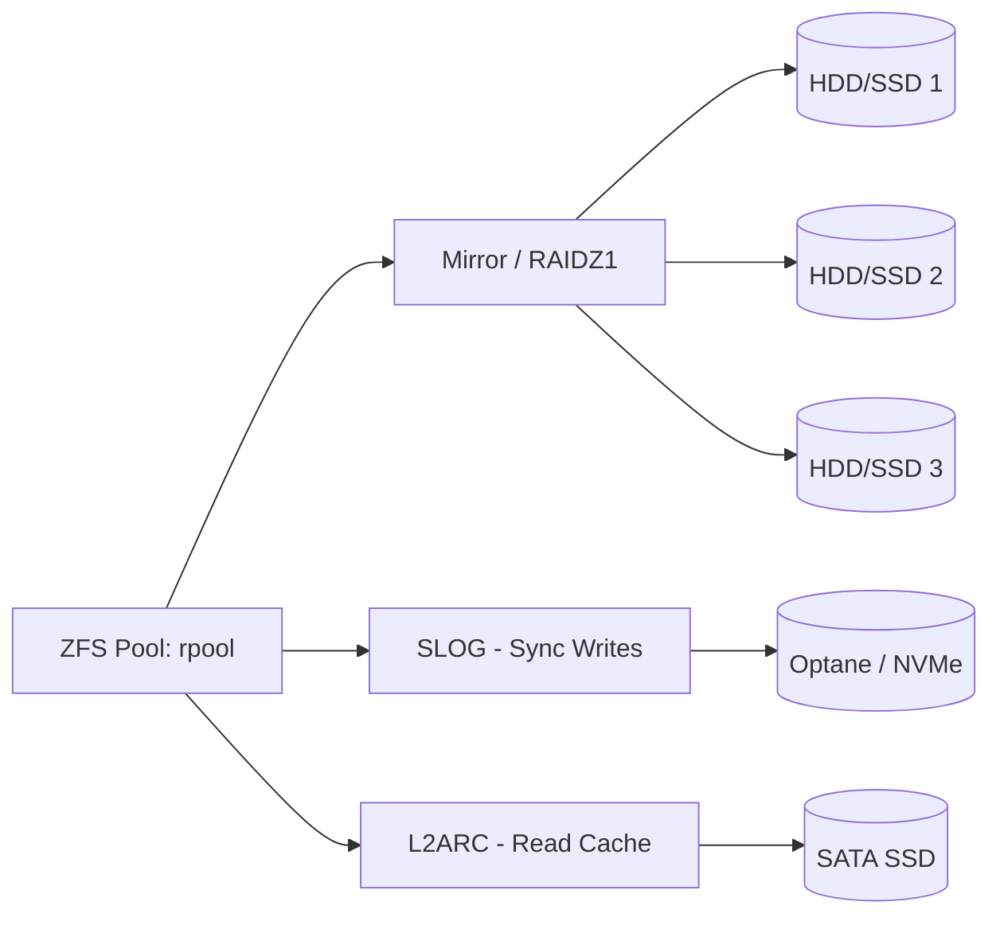

# Einrichtung und Verwaltung einer sicheren Proxmox VE Testumgebung

## Inhaltsverzeichnis

- [Kapitel 1 - Voraussetzungen und Enterprise-Architekturdesign](#kapitel-1---voraussetzungen-und-enterprise-architekturdesign)
  - [1.1 Hardware-Sizing und Topologie-Anforderungen](#11-hardware-sizing-und-topologie-anforderungen)
    - [1.1.1 Prozessor-Architektur (CPU) und Hardware-gestützte Virtualisierung](#111-prozessor-architektur-cpu-und-hardware-gesttzte-virtualisierung)
    - [1.1.2 Arbeitsspeicher (RAM) – Allokation und Caching-Dynamiken](#112-arbeitsspeicher-ram---allokation-und-caching-dynamiken)
    - [1.1.3 Storage-Architektur – Tiering und Datenintegrität](#113-storage-architektur---tiering-und-datenintegritt)
    - [1.1.4 Netzwerktopologie und Traffic-Segregation](#114-netzwerktopologie-und-traffic-segregation)
    - [1.1.5 Unterbrechungsfreie Stromversorgung (USV/UPS) und Power-Management](#115-unterbrechungsfreie-stromversorgung-usvups-und-power-management)
  - [1.2 Systemsoftware und Deployment-Prämissen](#12-systemsoftware-und-deployment-prmissen)
    - [1.2.1 Proxmox VE ISO-Deployment und Kryptografische Verifikation](#121-proxmox-ve-iso-deployment-und-kryptografische-verifikation)
    - [1.2.2 Linux-Administration und Debian-Interna](#122-linux-administration-und-debian-interna)
    - [1.2.3 Boot-Umgebung (UEFI-Konzepte vs. Legacy-BIOS)](#123-boot-umgebung-uefi-konzepte-vs-legacy-bios)
    - [1.2.4 Lifecycle-Management und Repository-Konfiguration](#124-lifecycle-management-und-repository-konfiguration)
    - [1.2.5 Basisinfrastrukturdienste: NTP und DNS (Die essenziellen Säulen)](#125-basisinfrastrukturdienste-ntp-und-dns-die-essenziellen-sulen)
  - [1.3 Netzwerktopologie und Routing-Architektur](#13-netzwerktopologie-und-routing-architektur)
    - [1.3.1 Enterprise-Switching und Layer-2-Isolation](#131-enterprise-switching-und-layer-2-isolation)
    - [1.3.2 IP-Adressmanagement (IPAM): Statisch vs. Dynamisch](#132-ip-adressmanagement-ipam-statisch-vs-dynamisch)
    - [1.3.3 Edge-Security und Routing-Policy](#133-edge-security-und-routing-policy)
- [Kapitel 2 – Enterprise-Deployment und Installation von Proxmox VE](#kapitel-2---enterprise-deployment-und-installation-von-proxmox-ve)
  - [2.1 ISO-Vorbereitung und Boot-Sequenz](#21-iso-vorbereitung-und-boot-sequenz)
    - [2.1.1 ISO-Beschaffung und Integritätsprüfung](#211-iso-beschaffung-und-integrittsprfung)
    - [2.1.2 Provisionierung eines bootfähigen USB-Installationsmediums](#212-provisionierung-eines-bootfhigen-usb-installationsmediums)
      - [Initiale Vorbereitungen:](#initiale-vorbereitungen)
      - [Boot-Medium Erstellung (DD-Modus)](#boot-medium-erstellung-dd-modus)
  - [2.2 Der Installationsprozess – Konzeptionelle Entscheidungen](#22-der-installationsprozess---konzeptionelle-entscheidungen)
  - [2.3 Post-Install: Konfiguration und Härtung](#23-post-install-konfiguration-und-hrtung)
    - [2.3.1 Repository-Management: Enterprise vs. Community](#231-repository-management-enterprise-vs-community)
    - [2.3.2 Patch-Management und initiales System-Update](#232-patch-management-und-initiales-system-update)
      - [Update-Workflow via grafischem Interface](#update-workflow-via-grafischem-interface)
      - [Patch-Management via Command Line Interface (CLI)](#patch-management-via-command-line-interface-cli)
      - [Governance und Lifecycle-Policies](#governance-und-lifecycle-policies)
    - [2.3.3 Zeitsynchronisation (NTP/Chrony)](#233-zeitsynchronisation-ntpchrony)
    - [2.3.4 Audit der Netzwerk-Schnittstellen](#234-audit-der-netzwerk-schnittstellen)
  - [2.4 Enterprise-Storage-Architektur: Design-Entscheidungen](#24-enterprise-storage-architektur-design-entscheidungen)
    - [2.4.1 ZFS (Das Software-Defined-Storage-Paradigma)](#241-zfs-das-software-defined-storage-paradigma)
    - [2.4.2 LVM / EXT4 / XFS](#242-lvm--ext4--xfs)
    - [2.4.3 Migration der Storage-Topologie](#243-migration-der-storage-topologie)
  - [2.5 Tipps und Fallstricke bei der Installation](#25-best-practices-und-fallstricke-beim-deployment)
  - [2.6 Erster Test: Erstellung der ersten VM](#26-proof-of-concept-provisionierung-der-ersten-vm)
- [Kapitel 3 – Storage-Konfiguration in Proxmox VE (ZFS, BTRFS, EXT4) und Best Practices](#kapitel-3---storage-konfiguration-in-proxmox-ve-zfs-btrfs-ext4-und-best-practices)
  - [3.1 Die unternehmenskritische Bedeutung des Storages](#31-die-unternehmenskritische-bedeutung-des-storages)
    - [Architektur-Übersicht: ZFS Storage-Topologie](#architektur-bersicht-zfs-storage-topologie)
    - [Deep-Dive: ZFS ARC Management und I/O-Analyse](#deep-dive-zfs-arc-management-und-io-analyse)
  - [3.2 Vergleich der Dateisysteme im Hypervisor-Umfeld](#32-evaluation-der-dateisysteme-im-hypervisor-umfeld)
    - [3.2.1 ZFS (Zettabyte File System)](#321-zfs-zettabyte-file-system)
    - [3.2.2 BTRFS (B-Tree File System)](#322-btrfs-b-tree-file-system)
    - [3.2.3 EXT4 (Fourth Extended Filesystem)](#323-ext4-fourth-extended-filesystem)
  - [3.3 Deep Dive: ZFS Architektur-Konzepte](#33-deep-dive-zfs-architektur-konzepte)
    - [3.3.1 VDEV-Topologien und RAID-Level](#331-vdev-topologien-und-raid-level)
    - [3.3.2 Caching-Tiering: SLOG und L2ARC](#332-caching-tiering-slog-und-l2arc)
    - [3.3.3 Lifecycle-Management durch Snapshots & Replikation](#333-lifecycle-management-durch-snapshots--replikation)
    - [3.3.4 Deduplizierung: Ein zweischneidiges Schwert](#334-deduplizierung-ein-zweischneidiges-schwert)
  - [3.4 BTRFS im Detail: Subvolumes und Storage-Tiering](#34-btrfs-im-detail-subvolumes-und-storage-tiering)
    - [3.4.1 Subvolumes und Namespace-Isolation](#341-subvolumes-und-namespace-isolation)
    - [3.4.2 RAID-Implementierungen](#342-raid-implementierungen)
    - [3.4.3 Nativ-Integration in Proxmox VE](#343-nativ-integration-in-proxmox-ve)
  - [3.5 EXT4: Die bewährte Legacy-Architektur](#35-ext4-die-bewhrte-legacy-architektur)
  - [3.6 Storage-Provisionierung in Proxmox VE (GUI & CLI)](#36-storage-provisionierung-in-proxmox-ve-gui--cli)
    - [3.6.1 Allgemeines Storage Onboarding (GUI)](#361-allgemeines-storage-onboarding-gui)
    - [3.6.2 Provisionierung eines ZFS-Pools (GUI)](#362-provisionierung-eines-zfs-pools-gui)
    - [3.6.3 Integration von Directory-Stores (BTRFS / EXT4)](#363-integration-von-directory-stores-btrfs--ext4)
  - [3.7 Storage Administration und Best Practices](#37-storage-administration-und-best-practices)
  - [3.8 Advanced Troubleshooting und Incident Management](#38-advanced-troubleshooting-und-incident-management)
  - [3.9 Executive Summary: Storage Architektur](#39-executive-summary-storage-architektur)
- [Kapitel 4 – Netzwerkkonfiguration](#kapitel-4---netzwerkkonfiguration)
  - [4.1 Warum Netzwerkkonfiguration so entscheidend ist](#41-warum-netzwerkkonfiguration-so-entscheidend-ist)
  - [4.2 Bridging in Proxmox VE](#42-bridging-in-proxmox-ve)
    - [4.2.1 Die architektonische Grundidee](#421-die-architektonische-grundidee)
    - [4.2.2 VLAN Awareness](#422-vlan-awareness)
    - [Deep-Dive: Linux Bridges und VLAN-Awareness](#deep-dive-linux-bridges-und-vlan-awareness)
  - [4.3 Netzwerk-Bonding](#43-netzwerk-bonding)
    - [4.3.1 Maximierung von Ausfallsicherheit und Bandbreite](#431-maximierung-von-ausfallsicherheit-und-bandbreite)
    - [4.3.2 Implementierung via Proxmox-GUI](#432-implementierung-via-proxmox-gui)
    - [4.3.3 Anforderungen an die physische Switch-Infrastruktur](#433-anforderungen-an-die-physische-switch-infrastruktur)
  - [4.4 VLAN-Konfiguration](#44-vlan-konfiguration)
    - [4.4.1 Strategische Zielsetzung der Netzwerksegmentierung](#441-strategische-zielsetzung-der-netzwerksegmentierung)
    - [4.4.2 Architekturvergleich: VLAN Aware Bridge vs. dediziertes Linux VLAN Interface](#442-architekturvergleich-vlan-aware-bridge-vs-dediziertes-linux-vlan-interface)
  - [4.5 Firewall-Architektur](#45-firewall-architektur)
    - [4.5.1 Die hostbasierte Proxmox-Firewall](#451-die-hostbasierte-proxmox-firewall)
    - [4.5.2 Externe Perimeter-Firewalls und virtuelle Appliances](#452-externe-perimeter-firewalls-und-virtuelle-appliances)
  - [4.6 IP-Adressmanagement: DHCP vs. Statische Zuweisungen](#46-ip-adressmanagement-dhcp-vs-statische-zuweisungen)
  - [4.7 Netzwerk-Performance und Low-Level-Tuning](#47-netzwerk-performance-und-low-level-tuning)
  - [4.8 Häufige Fehlerquellen im Netzwerk (Troubleshooting)](#48-kritische-fehlerquellen-in-der-netzwerkarchitektur-troubleshooting)
  - [4.9 Executive Summary](#49-executive-summary)
- [Kapitel 5 – Sicherheitsbest Practices in Proxmox VE](#kapitel-5---sicherheitsbest-practices-in-proxmox-ve)
  - [5.1 Grundlagen der Sicherheit in Proxmox VE](#51-grundlagen-der-sicherheit-in-proxmox-ve)
    - [5.1.1 Mehrschichtige Absicherung (Defense in Depth)](#511-mehrschichtige-absicherung-defense-in-depth)
    - [5.1.2 Proxmox-spezifische Aspekte](#512-proxmox-spezifische-aspekte)
    - [Deep-Dive: CrowdSec Troubleshooting](#deep-dive-crowdsec-troubleshooting)
  - [5.2 Firewall & Netzwerk-Absicherung](#52-firewall--netzwerk-absicherung)
    - [5.2.1 Integrierte Proxmox-Firewall](#521-integrierte-proxmox-firewall)
    - [5.2.2 Externe Firewall (pfSense, OPNsense, Hardware Appliances)](#522-externe-firewall-pfsense-opnsense-hardware-appliances)
  - [5.3 SSH-Härtung](#53-ssh-hrtung)
    - [5.3.1 Vermeidung von Standardkonfigurationen und Port-Regelungen](#531-vermeidung-von-standardkonfigurationen-und-port-regelungen)
    - [5.3.2 Public-Key-basierte Authentifizierung (PKI)](#532-public-key-basierte-authentifizierung-pki)
    - [5.3.3 Root-Login-Einschränkung und Privilegierungs-Delegation](#533-root-login-einschrnkung-und-privilegierungs-delegation)
    - [5.3.4 Zusätzliche Härtungsmechanismen](#534-zustzliche-hrtungsmechanismen)
  - [5.4 Multi-Faktor-Authentifizierung (MFA/2FA)](#54-multi-faktor-authentifizierung-mfa2fa)
    - [5.4.1 Rollout in der Proxmox-WebGUI](#541-rollout-in-der-proxmox-webgui)
    - [5.4.2 Strikte Richtlinien für Administrative Accounts](#542-strikte-richtlinien-fr-administrative-accounts)
  - [5.5 CrowdSec: Next-Generation Intrusion Prevention](#55-crowdsec-next-generation-intrusion-prevention)
    - [5.5.1 Installation und operative Integration](#551-installation-und-operative-integration)
    - [5.5.2 Architektur und Funktionsweise](#552-architektur-und-funktionsweise)
    - [5.5.3 Administratives Management und Incident Response](#553-administratives-management-und-incident-response)
  - [5.6 RBAC (Rollenbasierte Zugriffskontrolle)](#56-rbac-rollenbasierte-zugriffskontrolle)
    - [5.6.1 Das RBAC-Prinzip in Proxmox VE](#561-das-rbac-prinzip-in-proxmox-ve)
    - [5.6.2 Enterprise-Szenarien und Aufgabendelegation](#562-enterprise-szenarien-und-aufgabendelegation)
    - [5.6.3 Identity Lifecycle Management und Auditing](#563-identity-lifecycle-management-und-auditing)
  - [5.7 Keycloak als zentrale Single Sign-On (SSO) Architektur](#57-keycloak-als-zentrale-single-sign-on-sso-architektur)
    - [5.7.1 Strategische Vorteile von Keycloak](#571-strategische-vorteile-von-keycloak)
    - [5.7.2 Nativer Implementierungsprozess (OpenID Connect)](#572-nativer-implementierungsprozess-openid-connect)
    - [5.7.3 Fortgeschrittene Reverse-Proxy-Architektur (Forward Authentication)](#573-fortgeschrittene-reverse-proxy-architektur-forward-authentication)
  - [5.8 Weitere Sicherheitslayer (Advanced Threat Protection)](#58-weitere-sicherheitslayer-advanced-threat-protection)
    - [5.8.1 Intrusion Detection / Prevention (IDS/IPS: Suricata, Snort)](#581-intrusion-detection--prevention-idsips-suricata-snort)
    - [5.8.2 Mandatory Access Control (MAC: AppArmor/SELinux)](#582-mandatory-access-control-mac-apparmorselinux)
    - [5.8.3 Zentralisiertes Log-Management und Monitoring (ELK, Graylog)](#583-zentralisiertes-log-management-und-monitoring-elk-graylog)
    - [5.8.4 Patch- und Vulnerability Management](#584-patch--und-vulnerability-management)
  - [5.9 Zusammenfassung und Fazit](#59-zusammenfassung-und-fazit)
- [Kapitel 6 – Enterprise-Clustering und Hochverfügbarkeit (HA)](#kapitel-6---enterprise-clustering-und-hochverfgbarkeit-ha)
  - [6.1 Cluster-Architektur und Basisdienste](#61-cluster-architektur-und-basisdienste)
    - [6.1.1 Corosync-Messaging-Layer & Quorum-Management](#611-corosync-messaging-layer--quorum-management)
    - [6.1.2 Storage-Architekturen für HA-Umgebungen](#612-storage-architekturen-fr-ha-umgebungen)
    - [6.1.3 Netzwerkdesign und Traffic-Separation](#613-netzwerkdesign-und-traffic-separation)
  - [6.2 Cluster-Bereitstellung und Skalierung](#62-cluster-bereitstellung-und-skalierung)
    - [6.2.1 Initialisierung des primären Knotens](#621-initialisierung-des-primren-knotens)
    - [6.2.2 Integration sekundärer Knoten](#622-integration-sekundrer-knoten)
    - [6.2.3 Architektur-Entscheidungen: Zwei vs. Drei (und mehr) Knoten](#623-architektur-entscheidungen-zwei-vs-drei-und-mehr-knoten)
  - [6.3 Orchestrierung der Hochverfügbarkeit (HA)](#63-orchestrierung-der-hochverfgbarkeit-ha)
    - [6.3.1 Das HA-Konzept](#631-das-ha-konzept)
    - [6.3.2 Zwingende Systemvoraussetzungen](#632-zwingende-systemvoraussetzungen)
    - [6.3.3 Konfiguration der HA-Ressourcen](#633-konfiguration-der-ha-ressourcen)
    - [6.3.4 Mechanik des Failover-Vorgangs](#634-mechanik-des-failover-vorgangs)
  - [6.4 Live Migration (Zero-Downtime Relocation)](#64-live-migration-zero-downtime-relocation)
    - [6.4.1 Definition und technischer Hintergrund](#641-definition-und-technischer-hintergrund)
    - [6.4.2 Essenzielle Prärequisiten](#642-essenzielle-prrequisiten)
    - [6.4.3 Ausführungszyklus](#643-ausfhrungszyklus)
  - [6.5 Georedundanz (Standortübergreifendes Clustering)](#65-georedundanz-standortbergreifendes-clustering)
  - [6.6 Troubleshooting und Incident Management](#66-troubleshooting-und-incident-management)
- [Kapitel 7 - Backup-, Disaster-Recovery- und Ransomware-Mitigation](#kapitel-7---backup--disaster-recovery--und-ransomware-mitigation)
  - [7.1 Enterprise-Standard: Proxmox Backup Server (PBS)](#71-enterprise-standard-proxmox-backup-server-pbs)
    - [7.1.1 QEMU Dirty-Bitmapping und Block-Level Deduplizierung](#711-qemu-dirty-bitmapping-und-block-level-deduplizierung)
    - [7.1.2 Architektur- und Integrationskonzept](#712-architektur--und-integrationskonzept)
    - [7.1.3 Automatisiertes Lifecycle-Management und Retention Policies (Pruning)](#713-automatisiertes-lifecycle-management-und-retention-policies-pruning)
  - [7.2 Native Tools: VZDump für hybride Strategien](#72-native-tools-vzdump-fr-hybride-strategien)
  - [7.3 Deep-Dive: Zero-Trust, Ransomware-Schutz und Air-Gapping](#73-deep-dive-zero-trust-ransomware-mitigation-und-air-gapping)
  - [7.4 Disaster Recovery und Wiederherstellungsverfahren](#74-disaster-recovery-und-wiederherstellungsverfahren)
    - [7.4.1 GUI-basiertes Recovery-Management](#741-gui-basiertes-recovery-management)
    - [7.4.2 CLI-Fallback und Notfall-Recovery](#742-cli-fallback-und-notfall-recovery)
- [Kapitel 8 - Monitoring und Wartung](#kapitel-8---monitoring-und-wartung)
  - [8.1 Infrastruktur-Monitoring mit Zabbix](#81-infrastruktur-monitoring-mit-zabbix)
    - [8.1.1 Zabbix Agent 2 Installation](#811-zabbix-agent-2-installation)
    - [8.1.2 Proxmox REST API & Auto-Discovery (LLD)](#812-proxmox-rest-api--auto-discovery-lld)
    - [8.1.3 ZFS-Pools und Alerting](#813-zfs-pools-und-alerting)
  - [8.2 Log-Management (Optional)](#82-log-management-optional)
  - [8.3 Wartungsschritte im Cluster](#83-wartungsschritte-im-cluster)
  - [8.4 Deep-Dive: Enterprise Monitoring mit Zabbix](#84-deep-dive-enterprise-monitoring-mit-zabbix)
- [Kapitel 9 – Enterprise Infrastructure Automation & Orchestration](#kapitel-9---enterprise-infrastructure-automation--orchestration)
  - [9.1 Native Automatisierungsmechanismen: Cron-Jobs und System-Scripts](#91-native-automatisierungsmechanismen-cron-jobs-und-system-scripts)
  - [9.2 Configuration Management via Ansible](#92-configuration-management-via-ansible)
      - [Deep-Dive: Proxmox Node-Updates via Ansible](#deep-dive-proxmox-node-updates-via-ansible)
  - [9.3 Hooks und die Proxmox REST API](#93-hooks-und-die-proxmox-rest-api)
      - [Deep-Dive: Proxmox REST API nutzen (cURL)](#deep-dive-proxmox-rest-api-nutzen-curl)
  - [9.4 Deep-Dive: Infrastructure as Code (IaC)](#94-deep-dive-infrastructure-as-code-iac)
- [Kapitel 10 - Ausblick: Enterprise-Integration und hochgradige Automatisierung](#kapitel-10---ausblick-enterprise-integration-und-hochgradige-automatisierung)
  - [10.1 Proxmox Backup Server (PBS): Deduplizierung und Ransomware-Resilienz](#101-proxmox-backup-server-pbs-deduplizierung-und-ransomware-resilienz)
  - [10.2 Hyperconverged Infrastructure (HCI) durch Ceph-Integration](#102-hyperconverged-infrastructure-hci-durch-ceph-integration)
  - [10.3 Infrastructure as Code (IaC) und Configuration Management](#103-infrastructure-as-code-iac-und-configuration-management)
- [Kapitel 11 - Enterprise Monitoring, Observability & Disaster Recovery](#kapitel-11---enterprise-monitoring-observability--disaster-recovery)
  - [11.1 Ganzheitliches Infrastruktur-Monitoring mit Zabbix](#111-ganzheitliches-infrastruktur-monitoring-mit-zabbix)
  - [11.2 Disaster Recovery: Systemverhalten bei einem Node-Ausfall](#112-disaster-recovery-systemverhalten-bei-einem-node-ausfall)
  - [11.3 Infrastructure as Code (IaC) mittels Terraform](#113-infrastructure-as-code-iac-mittels-terraform)
- [Kapitel 12 - Fazit und Architekturausblick](#kapitel-12---fazit-und-architekturausblick)
  - [12.1 Strategische Empfehlungen für den Enterprise-Betrieb](#121-strategische-empfehlungen-fr-den-enterprise-betrieb)
  - [12.2 Referenzen und weiterführende Enterprise-Ressourcen](#122-referenzen-und-weiterfhrende-enterprise-ressourcen)


# Kapitel 1 - Voraussetzungen und Enterprise-Architekturdesign

In vielen Deployment-Guides wird die Phase der „Voraussetzungen“ nur als einfache Checkliste abgehandelt. In der Praxis bildet sie jedoch das Fundament für ein stabiles und schnelles System. Basiert ein Virtualisierungs-Cluster auf inkonsistenter Hardware oder einem fehlerhaften Netzwerkdesign, führt das oft zu Problemen bei der Skalierung und zu Single Points of Failure (SPOF). Eine sorgfältige Planung von Storage-I/O, Netzwerk-Latenzen und High-Availability-Mechanismen (HA) vermeidet spätere Engpässe in der Architektur. Dieses Kapitel definiert daher die technischen Spezifikationen und erklärt die Hintergründe der jeweiligen Architekturentscheidungen.

## 1.1 Hardware-Sizing und Topologie-Anforderungen

Ein Enterprise-Cluster benötigt auf allen Schichten des OSI-Modells und der physischen Infrastruktur durchgehende Redundanz. Zusätzlich ist ausreichend Puffer (Overhead) wichtig, um Workload-Spitzen abzufangen.

### 1.1.1 Prozessor-Architektur (CPU) und Hardware-gestützte Virtualisierung
Moderne x86_64-Architekturen wie die Intel Xeon Scalable Family oder AMD EPYC Prozessoren bilden die technische Basis. Für den Hypervisor-Betrieb müssen die hardwarebasierten Virtualisierungserweiterungen (**Intel VT-x** bzw. **AMD-V**) im UEFI aktiviert sein. 

Proxmox VE nutzt KVM (Kernel-based Virtual Machine) als zentralen Hypervisor. KVM ist als Modul direkt in den Linux-Kernel integriert und gibt die CPU-Instruktionen der virtuellen Maschinen nativ an die physischen Kerne weiter. Fehlen die Virtualisierungs-Flags, muss KVM auf eine softwarebasierte Emulation ausweichen. Das führt zu massiven Leistungseinbußen. Ergänzend ist IOMMU (Intel VT-d oder AMD-Vi) sehr wichtig. Diese Technologie ermöglicht PCI-Passthrough. Damit können physische PCIe-Geräte (wie GPU-Beschleuniger für Deep Learning oder dedizierte NICs für virtualisierte Firewalls) direkt an den Gast durchgereicht werden, ohne dass der Hypervisor eingreift.

### 1.1.2 Arbeitsspeicher (RAM) – Allokation und Caching-Dynamiken
Für Proof-of-Concept (PoC)-Umgebungen können 16 GB RAM ausreichen. Ein produktiver Enterprise-Einsatz erfordert jedoch deutlich mehr Kapazität, in der Regel ab 32 GB aufwärts. In dichten Virtualisierungsumgebungen ist der Arbeitsspeicher oft der wichtigste Flaschenhals.

Jede virtuelle Maschine belegt fest zugewiesenen RAM. Das Storage-System ZFS benötigt jedoch oft noch mehr Arbeitsspeicher. ZFS nutzt freien Host-RAM dynamisch als schnellen Lese-Cache, den ARC (Adaptive Replacement Cache). Als Best Practice gilt hierbei: ZFS benötigt ausreichend RAM für den ARC-Cache. Für Standard-Setups empfehlen sich mindestens 4 bis 8 GB Arbeitsspeicher.
**Vorsicht bei ZFS-Deduplizierung:** Die Aktivierung der Deduplizierung erhöht den RAM-Bedarf für die Deduplication Table (DDT) massiv (ca. 1-5 GB RAM pro Terabyte Storage). Wenn dieser RAM fehlt, muss ZFS die Hash-Tabellen bei jedem Lese- und Schreibvorgang von den Festplatten lesen (DDT Thrashing). Das senkt die I/O-Leistung erheblich.

*Enterprise-Best-Practice:* Für Storage-Knoten wird die Nutzung von **ECC-RAM (Error-Correcting Code)** dringend empfohlen. Da ZFS Prüfsummen im flüchtigen Speicher verifiziert, könnten Speicherkorruptionen (Bit-Flips) sonst auf die Festplatte geschrieben werden. Das würde zu dauerhaft fehlerhaften Daten führen (Silent Data Corruption).

### 1.1.3 Storage-Architektur – Tiering und Datenintegrität
Ein stabiles Design trennt die Hypervisor-Installation von den produktiven Workload-Daten:
* **Systemlaufwerk:** Das Proxmox OS sollte auf einem gespiegelten (RAID1) Verbund aus Enterprise-SSDs oder NVMes laufen. Das schützt vor Ausfällen des gesamten Hosts, falls ein Laufwerk defekt ist.
* **Storage-Laufwerke:** Für den VM-Datastore ist **ZFS** Best Practice (z.B. als Mirror oder RAID-Z). ZFS bietet hohe Datenintegrität, Block-Level-Kompression und performante Copy-on-Write (CoW) Snapshots. Alternativen wie EXT4 oder LVM-Thin sind flexibel, haben aber nicht die integrierten Validierungsmechanismen von ZFS. Für skalierbare und hochverfügbare Cluster wird ein verteilter Storage **wie Ceph** dringend empfohlen. Dafür müssen dedizierte Datenträger als OSDs (Object Storage Daemons) bereitgestellt werden.

Bei Flash-Speichern (SSDs/NVMes) sind die IOPS (Input/Output Operations Per Second) und die Lebensdauer (TBW - Terabytes Written) wichtige Metriken. Die CoW-Architektur von ZFS erzeugt eine hohe Write Amplification (Schreibverstärkung). Consumer-Laufwerke verschleißen hierbei sehr schnell. Es ist Best Practice, Datacenter-Laufwerke mit Power Loss Protection (PLP) zu verwenden.

### 1.1.4 Netzwerktopologie und Traffic-Segregation
Ein einzelner Gigabit-Uplink reicht für Enterprise-Cluster nicht aus. Es werden mindestens zwei, idealerweise vier physische Interfaces empfohlen. Diese sollten über LACP-Bonding (802.3ad) zu hochverfügbaren, logischen Links zusammengefasst werden.

Die Kommunikation zwischen den Knoten – speziell der Corosync-Traffic für das Cluster-Quorum, HA-Heartbeats und Live-Migrationen – sollte als Best Practice Latenzen unter 5ms aufweisen. Obwohl Kronosnet über robuste Retransmission-Mechanismen verfügt und einzelne Paketverluste abfängt, führt ein andauernder Paketverlust, der das Token-Timeout überschreitet, zum Quorum-Verlust. In Produktionsumgebungen wird eine saubere Trennung über VLANs dringend empfohlen. Ein hoher I/O-Transfer (z. B. durch ein Backup) im Storage-Netzwerk darf den kritischen Heartbeat-Traffic nicht blockieren. Sonst kann ein Split-Brain-Zustand entstehen, der zu einem Node-Fencing führt.

### 1.1.5 Unterbrechungsfreie Stromversorgung (USV/UPS) und Power-Management
Im Rechenzentrumsbetrieb ist eine USV Best Practice. Copy-on-Write-Dateisysteme wie ZFS sind sehr anfällig für plötzliche Stromausfälle, besonders wenn der ZFS Intent Log (ZIL) noch nicht auf den Speicher geschrieben wurde. Durch die Einbindung von Network UPS Tools (NUT) können Hypervisor-Knoten bei einem Stromausfall sauber heruntergefahren werden, um Datenverlust zu vermeiden.

## 1.2 Systemsoftware und Deployment-Prämissen

### 1.2.1 Proxmox VE ISO-Deployment und Kryptografische Verifikation
Die Installation beginnt mit dem Download des aktuellen Proxmox VE ISO-Images über die offiziellen Quellen ([proxmox.com/downloads](https://www.proxmox.com/en/downloads)). Danach wird eine kryptografische Prüfung mit `sha256sum proxmox-ve_*.iso` dringend empfohlen. So lassen sich manipulierte Dateien oder unvollständige Downloads frühzeitig erkennen, bevor das System installiert wird.

### 1.2.2 Linux-Administration und Debian-Interna
Proxmox VE basiert auf **Debian GNU/Linux**. Daher sind solide Linux-Kenntnisse auf der Kommandozeile wichtig. Der sichere Umgang mit dem APT-Paketmanager (`apt update`, `apt dist-upgrade`), der systemd-Dienstverwaltung (`systemctl status pveproxy`) und Netzwerk-Tools (`ip a`, `ping`, `traceroute`) hilft bei der Fehlersuche. Auch das Wissen über die Dateisystemstruktur (z. B. Cluster-Konfigurationen im pmxcfs unter `/etc/pve`, Logs unter dem `systemd-journald` (via `journalctl`)) beschleunigt die Lösung von Problemen erheblich.

### 1.2.3 Boot-Umgebung (UEFI-Konzepte vs. Legacy-BIOS)
Für das Erstellen des Installations-USB-Sticks (mind. 8 GB) eignen sich **Tools wie Rufus (Windows) oder balenaEtcher** (macOS/Linux), da sie exakte Block-Level-Kopien erstellen. Im BIOS des Servers sollte der Boot-Modus **auf UEFI** eingestellt werden. Ab Proxmox VE 8.1 funktioniert Secure Boot direkt über den signierten Shim-Bootloader. Das Deaktivieren von Secure Boot oder die Nutzung eigener MOKs (Machine Owner Keys) ist damit nicht mehr nötig.

### 1.2.4 Lifecycle-Management und Repository-Konfiguration
Das Enterprise-Repository von Proxmox bietet höchste Stabilität für produktive Umgebungen und liefert getestete Pakete für Kunden mit Subscription. Ohne aktive Subscription (z. B. in PoC-Umgebungen) ist es Best Practice, nach der Installation auf **das Community-Repository** (`pve-no-subscription`) umzustellen. Das stellt sicher, dass das System weiterhin wichtige Security-Patches und Bugfixes für Kernel und Hypervisor erhält.

### 1.2.5 Basisinfrastrukturdienste: NTP und DNS (Die essenziellen Säulen)
Zwei Basisdienste sind für die Stabilität von Clustern entscheidend und werden oft übersehen:
* **NTP (Network Time Protocol):** Zeitliche Abweichungen zwischen den Knoten machen API-Tokens ungültig, stören TLS-Zertifikate und können zum Ausfall des Corosync-Quorums führen.
* DNS (Domain Name System): Die Cluster-Verwaltung und das Zertifikatsmanagement benötigen eine funktionierende Forward- und Reverse-Namensauflösung. Eine saubere `/etc/hosts` sowie ein redundantes, lokales DNS-Setup bilden dafür die Basis.

## 1.3 Netzwerktopologie und Routing-Architektur

Ein klares und gut geplantes Netzwerkdesign verhindert kritische Fehler beim Cluster-Aufbau, wie zum Beispiel instabile Corosync-Verbindungen.

### 1.3.1 Enterprise-Switching und Layer-2-Isolation
Die Netzwerkhardware muss den **Standard 802.1Q (VLAN-Tagging)** nativ beherrschen, um virtuelle Maschinen sicher und getrennt voneinander zu betreiben. Für Link-Redundanz und das Bündeln von Bandbreite ist die **Unterstützung des LACP-Protokolls (802.3ad)** an den Switches erforderlich.

### 1.3.2 IP-Adressmanagement (IPAM): Statisch vs. Dynamisch
Für Hypervisor-Hosts werden **statische IP-Adressen** fest vorausgesetzt. Die Nutzung von DHCP für Proxmox-Knoten ist fehleranfällig: Ein abgelaufener Lease oder IP-Wechsel führt direkt zum Verlust des Quorums, da Corosync die IPs der Hosts fest speichert. Proxmox friert dann die Cluster-Aktionen ein oder löst Fencing (HA) aus, um Datenkorruption zu verhindern. Virtuelle Maschinen (VMs) können dagegen problemlos dynamisch über DHCP verwaltet werden.

### 1.3.3 Edge-Security und Routing-Policy
Ein klares Routing- und Firewall-Konzept sollte frühzeitig geplant werden. Ob eine Hardware-Appliance (z. B. pfSense / OPNsense) oder eine virtuelle Router-VM genutzt wird, beeinflusst das gesamte VLAN-Design. Der Zugang zur Proxmox-WebGUI (Port 8006/TCP) sollte niemals ungeschützt aus dem Internet (WAN) erreichbar sein. Für die Fernwartung ist es Best Practice, gesicherte VPN-Tunnel (z. B. WireGuard, OpenVPN) oder Zero-Trust-Konzepte zu verwenden.

# Kapitel 2 – Enterprise-Deployment und Installation von Proxmox VE

Nachdem die Architektur- und Hardware-Parameter feststehen, behandelt dieses Kapitel die erste Installation. Dieser Prozess umfasst mehr als nur das Klicken durch einen Assistenten, wie beispielsweise die ISO-basierte Installation, automatisierte PXE-Boots für größere Umgebungen sowie wichtige Design-Entscheidungen. Dazu gehören das ZFS-Root-Partitionierungsschema und grundlegende Post-Install-Härtungsmaßnahmen.

## 2.1 ISO-Vorbereitung und Boot-Sequenz

### 2.1.1 ISO-Beschaffung und Integritätsprüfung

1. **Bezugsquelle:** Laden Sie das Image über [proxmox.com/en/downloads](https://www.proxmox.com/en/downloads) herunter.
2. **Dateiauswahl:** Wählen Sie das passende Image `proxmox-ve_**.iso` für Ihre Umgebung (z. B. Major-Releases 7.x oder 8.x).
3. Kryptografische Hash-Prüfung: 
   * Eine Hash-Prüfung wird dringend empfohlen, um fehlerhafte oder manipulierte Downloads auszuschließen. Führen Sie in einer Shell den Befehl `sha256sum proxmox-ve_*.iso` aus. Vergleichen Sie den generierten Hashwert mit der Signatur auf der Proxmox-Website.
   * Bei einer Abweichung sollte das ISO-Image aus Sicherheitsgründen neu heruntergeladen werden.

### 2.1.2 Erstellung eines bootfähigen USB-Installationsmediums

Für Bare-Metal-Installationen benötigen Sie meist ein Bootmedium, um Proxmox VE auf der Hardware zu installieren. Hier finden Sie bewährte Methoden für gängige Betriebssysteme und die Unterschiede zwischen UEFI- und Legacy-Boot.
#### Initiale Vorbereitungen:

1. **Hardware-Anforderungen:** Ein zuverlässiger USB-Stick mit mindestens **8 GB** Speicherplatz.
* Die vorab geprüfte Proxmox VE ISO-Datei von der [offiziellen Proxmox-Website](https://www.proxmox.com/en/downloads).

2. **Kritische Hinweise:**
   * **Datenverlust-Prävention:** Der Schreibvorgang überschreibt alle Daten auf dem USB-Medium. Sichern Sie vorher wichtige Dateien.
   * Prüfen Sie vorab, ob Ihre Hardware UEFI oder Legacy-Boot unterstützt. So vermeiden Sie spätere Installationsfehler.

#### Boot-Medium Erstellung (DD-Modus)
Das ISO-Image sollte im DD-Modus (RAW-Modus) auf den USB-Stick geschrieben werden. Es handelt sich um ein Hybrid-Image. Tools wie Rufus (für Windows) bieten diesen Modus beim Schreiben an. Optionen wie "FAT32" oder "Schnellformatierung" werden dabei automatisch deaktiviert. Wird das ISO-Image stattdessen im Standard-Modus entpackt, schlägt der Bootvorgang meist fehl. Zudem warnt Proxmox offiziell vor Multiboot-Tools wie **Ventoy**. Startet man das PVE-ISO regulär über Ventoy, scheitert der Installer im initramfs oft mit dem Fehler "no cdrom found", da er seinen Payload nicht findet (außer man nutzt spezielle Workarounds wie den Grub2-Modus). Rufus im DD-Modus oder balenaEtcher sind hier die bewährtesten Wege.

## 2.2 Der Installationsprozess – Konzeptionelle Entscheidungen

Die im grafischen Installer getroffenen Entscheidungen bestimmen die Skalierbarkeit und Ausfallsicherheit Ihrer Umgebung.

1. **Lizenz-** und SLA-Akzeptanz


* Proxmox VE nutzt die AGPL v3 Lizenz. Das garantiert Open Source. Für Enterprise-Support benötigen Sie jedoch eine kostenpflichtige Subscription.

2. **Storage-Topologie für** das Root-Filesystem

* Im Target-Disk-Dialog legen Sie das Basis-Storage fest.
   * Für Enterprise-Umgebungen wird **ZFS als Root-FS** („**ZFS RAID**“) stark empfohlen.
     * Wählen Sie eine ausfallsichere Konfiguration. Beispiele sind ein Mirror (RAID1) mit zwei Enterprise-SSDs oder RAIDZ1 für Cluster.
       
   
   * Die Alternative **EXT4 über LVM** ist schnell und einfach. Hierbei fehlt jedoch der Bit-Rot-Schutz von ZFS. Auch die nativen ZFS-Snapshots stehen nicht zur Verfügung. Proxmox bietet über LVM-Thin aber ebenfalls Snapshots auf Blockebene an.

3. **Lokalisierung und Zeit-Synchronisation** 

* Eine genaue Einstellung ist für verteilte Systeme wichtig:
* **Timezone** (z.B. Europe/Berlin) hilft bei der Auswertung von Logs.
* **Keyboard Layout** erleichtert die Arbeit in Notfällen über iLO oder iDRAC.

4. **Authentifizierung & Alerting**


   * Root-Credentials: Nutzen Sie sichere Passwörter nach aktuellen BSI- oder NIST-Vorgaben.
   * Admin-E-Mail: Diese wird dringend für Systemwarnungen benötigt, etwa bei fehlerhaften ZFS-Pools oder abgebrochenen Backups.

5. Netzwerk-Architektur


   * Vergeben Sie für die Management-IP feste Werte (IP, CIDR, Gateway, DNS).
   * Tragen Sie den Hostnamen als vollqualifizierten Domainnamen (FQDN) ein (z. B. `pve01.mgmt.datacenter.internal`).
> **Critical Design Warning:** Jeder Node in einem Corosync-Cluster benötigt eine eigene IP und einen eindeutigen Hostnamen. Doppelte Namen können zu einem Split-Brain-Problem führen.

6. **Installation & Laufwerkseinrichtung**


   * Der Installer partitioniert die Laufwerke automatisch und legt LVs (Logical Volumes) oder Z-Pools an.
   * Die Dauer hängt von der Geschwindigkeit (IOPS) Ihrer SSDs oder NVMes ab.

7. **System-Reboot**
   * Entfernen Sie nach der Installation das USB-Medium und starten Sie das System neu.

## 2.3 Post-Install: Konfiguration und Härtung

Nach dem ersten Start verbinden Sie sich über das Management-Interface oder per Out-of-Band-Management:
* **Web-UI (HTTPS)**: `https://<Management-IP>:8006`
   * Proxmox erstellt ein selbstsigniertes SSL/TLS-Zertifikat (pveproxy). Die Browser-Warnung können Sie beim ersten Login ignorieren. Später sollten Sie Let's Encrypt oder eigene PKI-Zertifikate einrichten.
* **Authentifizierung**: Melden Sie sich als `root` im Realm `PAM` mit Ihrem Kennwort an.


> Operations-Tipp: Wenn Port 8006 nicht erreichbar ist, prüfen Sie das Routing und die Firewalls. Auf der lokalen Konsole können Sie mit `systemctl status pveproxy` den Status des Dienstes abfragen.

### 2.3.1 Repository-Verwaltung: Enterprise vs. Community

Standardmäßig ist das **Enterprise-Repository** aktiv. Es benötigt eine gültige Subscription. In Testumgebungen oder ohne Lizenz sollten Sie auf das **No-Subscription-Repository** wechseln, um Paketkonflikte zu vermeiden:

  ```bash
  # Enterprise-Repositories (PVE & Ceph) deaktivieren
  sed -i "s/^deb /#deb /" /etc/apt/sources.list.d/pve-enterprise.list
  sed -i "s/^deb /#deb /" /etc/apt/sources.list.d/ceph.list

  # Community-Repository einrichten
  echo "deb http://download.proxmox.com/debian/pve bookworm pve-no-subscription" > /etc/apt/sources.list.d/pve-no-subscription.list

  # APT-Cache aktualisieren
  apt-get update
  ```

### 2.3.2 Patch-Management und erstes System-Update

Ein Server ohne aktuelle Updates ist ein Sicherheitsrisiko. Installieren Sie die neuesten Kernel- und Paketupdates zeitnah, um bekannte Lücken (CVEs) zu schließen und das System stabil zu halten.
#### Update-Workflow über die grafische Oberfläche

Die GUI bietet eine gute Übersicht für Updates.

1. **Repositories prüfen:**
   * Gehen Sie links im Menü auf **Datacenter → Node → Repositories**.
* Prüfen Sie die Paketquellen. Ohne Enterprise-Lizenz markieren Sie das Repository `pve-enterprise` und deaktivieren es.
   * Fügen Sie die Community-Quellen hinzu:
     * Klicken Sie auf **Add**.
     ** Wählen Sie im Dropdown-Menü `No-Subscription`.
       
     * Bestätigen Sie mit **Add**.

2. **Updates ausführen:**
   * Wechseln Sie zu **Node → Updates**.
* Klicken Sie auf **Refresh** (entspricht `apt update`).
* Starten Sie das Update über **Upgrade**. Es öffnet sich ein Terminal-Fenster, das den Fortschritt anzeigt.

3. **Neustart prüfen:**
   * Nach Updates von libc oder dem Linux-Kernel wird ein kompletter Host-Neustart dringend empfohlen. Bei Updates des KVM/QEMU-Pakets reicht es hingegen aus, die virtuellen Maschinen zu migrieren oder neu zu starten (Stop/Start). Das vermeidet Fehler im Arbeitsspeicher.
   * Starten Sie das System über Node → System → Reboot neu.

#### Patch-Management über die Kommandozeile (CLI)

Für Automatisierungstools (wie Ansible) oder erfahrene Admins ist der Shell-Zugriff oft schneller.

1. **SSH-Verbindung aufbauen:**
   * `ssh root@<Management-IP>`

2. **Repositories anpassen:**
   * Lizenzpflichtige Repos deaktivieren (PVE & Ceph):
     ```bash
     sed -i "s/^deb /#deb /" /etc/apt/sources.list.d/pve-enterprise.list
     sed -i "s/^deb /#deb /" /etc/apt/sources.list.d/ceph.list
     ```
   * No-Subscription Repo hinzufügen:
     ```bash
     echo "deb http://download.proxmox.com/debian/pve bookworm pve-no-subscription" > /etc/apt/sources.list.d/pve-no-subscription.list
     apt-get update
     ```

3. **Vollständiges Upgrade ausführen:**
   * Proxmox empfiehlt `dist-upgrade`, um Paketabhängigkeiten korrekt aufzulösen:
     ```bash
     apt-get dist-upgrade
     ```

4. **System neu starten:**
   * `reboot`

#### Wartung und Updates

1. **Patch-Zyklen:** Legen Sie feste Wartungsfenster fest. Updates sollten vor dem Einsatz in der Produktion getestet werden.
2. **Disaster Recovery:**
   * Prüfen Sie vor Kernel-Updates Ihre Backups der wichtigsten VMs. Die Proxmox-Backup-Funktion (VZDump) eignet sich dafür gut.
3. **Monitoring:**
   * Kontrollieren Sie nach einem Update das dmesg-Log und den Syslog. Achten Sie auf Kernel-OOM-Meldungen oder Hardware-Fehler.

### 2.3.3 Zeitsynchronisation (NTP/Chrony)

Navigation: _Datacenter_ → _Node_ → _System_ → _Time_.
* Tragen Sie zuverlässige, am besten interne NTP-Server (Stratum-1 oder Stratum-2) ein.
* Wichtig für Cluster: Corosync 3 basiert für Timeouts auf dem Monotonic Clock des Kernels. Ein Zeitunterschied der Wall-Clock von >250ms führt zwar nicht zum Ausfall von Corosync, stört jedoch Ceph massiv (striktes 50ms Limit) und kann Zertifikatsprozesse invalidieren. Daher ist ein präziser NTP-Dienst unerlässlich. Auch TOTP-Logins schlagen bei abweichender Uhrzeit fehl.

### 2.3.4 Netzwerk-Schnittstellen prüfen

Navigation: _Datacenter_ → _Node_ → _System_ → _Network_:
* Überprüfen Sie die aktiven Netzwerkkarten.
* Hier können Sie erweiterte Setups wie LACP-Bonds (802.3ad) oder OVS-Bridges anlegen.
* Vorsicht: Fehler bei der Management-Bridge (`vmbr0`) sperren Sie aus dem System aus. Testen Sie Änderungen am besten mit der "Apply Configuration"-Funktion.

## 2.4 Storage-Architektur: Design-Entscheidungen

### 2.4.1 ZFS

Wenn Sie **ZFS** gewählt haben, richtet Proxmox den Root-Pool (`rpool`) ein.
* Vorteile: Schnelle Snapshots, transparente Datenkompression (LZ4/ZSTD), Schutz vor Bit-Rot durch Checksummen und ein nativer Volume-Manager für ZVols (Block-Storage für VMs).
* **Hinweise**: ZFS nutzt den ARC (Adaptive Replacement Cache). Das erhöht den RAM-Bedarf des Hosts (Faustregel: 1 GB RAM pro 1 TB Storage, falls nicht manuell begrenzt). Hardware-RAID-Controller (wie MegaRAID oder PERC) sollten für ZFS vermieden werden. Nutzen Sie stattdessen HBAs im IT-Mode.

### 2.4.2 LVM / EXT4 / XFS

Die klassische Variante nutzt LVM und ein Standard-Dateisystem.
* Das eignet sich für Server mit wenig Arbeitsspeicher. Auch bei externem SAN-Storage (iSCSI, Fibre Channel) ist dies sinnvoll, da dort der Array-Controller die Storage-Funktionen übernimmt.

### 2.4.3 Wechsel der Storage-Topologie

Ein nachträglicher Wechsel von LVM zu ZFS bedeutet Ausfallzeit und erfordert eine Neuinstallation (Bare-Metal-Restore). Planen Sie das gewünschte Setup daher am besten direkt vor der Installation.

## 2.5 Tipps und Fallstricke bei der Installation

1. BIOS vs. UEFI und Secure Boot
   * Wenn der USB-Boot auf älterer Hardware fehlschlägt, testen Sie den Legacy-Modus. Seit PVE 8.1 wird Secure Boot offiziell unterstützt. Es wird empfohlen, Secure Boot aktiviert zu lassen.

2. **Fehlende CPU-Virtualisierungs-Flags**
   * Ohne VT-x (Intel) oder AMD-V läuft der KVM-Hypervisor langsam (Software-Emulation) oder VMs starten gar nicht. Prüfen Sie diese Einstellungen vorab im BIOS.

3. **Reste auf Festplatten (Dirty Disks)**
   * Gebrauchte SSDs enthalten oft alte GPT-Tabellen oder ZFS-Metadaten. Der Installer kann daran kommentarlos scheitern. Führen Sie idealerweise vorab in einem Live-System `wipefs -a /dev/sdX` aus.

4. DHCP auf Management-Schnittstellen
   * Vergeben Sie für das Management-Interface (`vmbr0`) eine feste IP. DHCP sollte hier vermieden werden. Ändert sich die IP-Adresse im laufenden Betrieb, bricht die Corosync-Cluster-Kommunikation ab.

5. Falsche Repository-Einstellungen
   * Update-Fehler beim Ausführen von `apt update` liegen fast immer an aktiven Enterprise-Repos, für die keine Subscription vorliegt.

## 2.6 Erster Test: Erstellung der ersten VM
* **Empfehlung:** Testen Sie die Stabilität des Servers vor dem Produktivbetrieb mit einer Test-VM.

1. ISO hochladen
   * Datacenter → Node → Storage (z. B. `local`) → Content → Upload.
   * Laden Sie ein kleines Image hoch (z. B. Ubuntu Server oder Debian).

2. **VM-Einstellungen festlegen**
   * Starten Sie den Assistenten über _Create VM_. Vergeben Sie eine sinnvolle VM-ID und einen Namen.
   * Wählen Sie den virtio-SCSI-Controller für gute Leistung und bestimmen Sie das Storage.
   * CPU/RAM: Zum Beispiel 2 Cores und 2 GB RAM. Wählen Sie als CPU-Typ `host` für die beste Performance.
   * Netzwerk: Verbinden Sie die Netzwerkkarte mit der Bridge `vmbr0`. Als Modell wird `VirtIO (paravirtualized)` dringend empfohlen.

3. Boot & OS-Installation
   * Starten Sie die VM und öffnen Sie die Konsole (noVNC).
   * Prüfen Sie während der Installation, ob das Storage und das Netzwerk stabil laufen.

4. **Snapshots testen**
   * Erstellen Sie direkt nach der Installation im Reiter "Snapshots" einen ersten Snapshot.
   * Das stellt sicher, dass Ihr Storage (ZFS ZVols oder LVM-Thin) fehlerfrei funktioniert.

# Kapitel 3 – Storage-Konfiguration in Proxmox VE (ZFS, BTRFS, EXT4) und Best Practices

Nach der Installation von Proxmox VE ist die Planung eines stabilen und schnellen Speichersystems wichtig. Die Storage-Architektur bildet das Rückgrat der Virtualisierungsumgebung. In dieser Phase treffen Sie wichtige Entscheidungen zum Dateisystem, zur RAID-Topologie und zu Storage-Features wie Copy-on-Write-Snapshots, asynchroner Replikation und Inline-Kompression. Die beste Storage-Strategie hängt stark von der physischen Infrastruktur ab. Dazu gehören JBOD-Setups, Hardware-RAID-Controller, All-Flash-Arrays (NVMe/SSD) oder hybride HDD-Kombinationen.

## 3.1 Die Bedeutung des Storages für Unternehmen

Eine gute Storage-Planung ist für einen stabilen IT-Betrieb aus mehreren Gründen wichtig:

1. **I/O-Performance als Flaschenhals:**
   In virtuellen Clustern schreiben und lesen viele VMs gleichzeitig Daten. Die I/O-Leistung (IOPS) des Speichers bestimmt die Latenz und Reaktionszeit der VMs. Eine zu klein geplante Storage-Umgebung führt oft zu Performance-Engpässen. Diese sogenannten I/O-Waits können das gesamte System verlangsamen. Moderne Dateisysteme wie ZFS oder BTRFS nutzen Funktionen wie Copy-on-Write (CoW), Inline-Kompression und Block-Level-Checksums. Diese Features verbessern die Datenkonsistenz deutlich, erfordern aber eine genaue Ressourcenplanung.

2. **Datenintegrität:**
Im Enterprise-Umfeld hat der Schutz vor schleichender Datenkorruption (Silent Data Corruption oder Bit Rot) hohe Priorität. ZFS löst dieses Problem direkt, da es alle Datenblöcke über kryptografische Checksummen prüft. Defekte Blöcke werden im laufenden Betrieb erkannt. Wenn Paritätsdaten über Mirroring oder RAID-Z vorhanden sind, repariert das System sie automatisch (Self-Healing). Ein gut geplantes RAID-Layout senkt außerdem das Risiko von Datenverlusten bei Hardwareausfällen spürbar.

3. **Effizientes Lifecycle-Management durch Snapshots und Replikation**
Die Möglichkeit, konsistente Snapshots von VMs oder Linux-Containern (LXC) in Sekundenbruchteilen zu erstellen, erleichtert das Backup- und Patch-Management. Durch die Copy-on-Write-Architektur benötigen diese Snapshots anfangs keinen zusätzlichen Speicherplatz. Zudem erlaubt die asynchrone Block-Replikation eine effiziente Übertragung von Delta-Zuständen an Failover-Knoten. Das ist ein wichtiger Baustein für hochverfügbare (HA) Cluster und aktuelle Disaster-Recovery-Konzepte.

### Architektur-Übersicht: ZFS Storage-Topologie



### Deep-Dive: ZFS ARC Management und I/O-Analyse
Das Speichermanagement von ZFS wird oft missverstanden. ZFS nutzt den **Adaptive Replacement Cache (ARC)**. Dieser unterscheidet sich deutlich vom klassischen Linux-Page-Cache. Der ARC nutzt nicht nur das **Least Recently Used** (LRU) Prinzip, sondern bevorzugt auch *Most Frequently Used* (MFU) Datenblöcke. Dieser hybride Ansatz sorgt für eine sehr gute Hit-Ratio.
* **Speicher-Allokation:** Standardmäßig (seit Proxmox VE 8.1) nutzt der ZFS ARC bis zu 10 % des verfügbaren Host-Arbeitsspeichers. In Hypervisor-Umgebungen sollten Sie dieses Limit an die Systemressourcen anpassen. So vermeiden Sie, dass den VMs der Arbeitsspeicher ausgeht (Memory Starvation). Die Anpassung erfolgt dauerhaft über die Kernel-Modul-Konfiguration, zum Beispiel in `/etc/modprobe.d/zfs.conf` mit `options zfs zfs_arc_max=...`. **Kritisch:** Danach ist ein Update des Initramfs (`update-initramfs -u -k all`) Best Practice. Bei Systemen mit ZFS und UEFI-Boot (systemd-boot) synchronisiert ein PVE-Kernel-Hook (`/etc/kernel/postinst.d/zz-proxmox-boot`) die Kernel-Images anschließend vollautomatisch in die EFI-Partitionen.

Das ARC-Limit lässt sich auch im laufenden Betrieb anpassen. Ein Neustart ist dafür nicht erforderlich:
```bash
echo 34359738368 > /sys/module/zfs/parameters/zfs_arc_max
```

Um das Limit rebootfest zu speichern, tragen Sie es in `/etc/modprobe.d/zfs.conf` (z. B. `options zfs zfs_arc_max=34359738368`) ein und aktualisieren das Initramfs.
* **Performance-Troubleshooting:** Bei Latenzproblemen in den VMs ist `zpool iostat -v 1` ein sehr hilfreiches Werkzeug. Es zeigt I/O-Metriken auf VDEV-Ebene in Echtzeit an und macht physische Überlastungen schnell sichtbar.

## 3.2 Vergleich der Dateisysteme im Hypervisor-Umfeld

### 3.2.1 ZFS (Zettabyte File System)

ZFS kombiniert Logical Volume Manager (LVM) und Dateisystem in einer Lösung. Es hat sich als Standard im Proxmox-Umfeld etabliert.

* Technologische Merkmale:
  Das Kernprinzip von ZFS ist Copy-on-Write (CoW). Modifikationen überschreiben bestehende Datenblöcke nicht (Copy-on-Write). Geänderte Daten werden immer in neue Blöcke geschrieben, bevor das System die Metadaten aktualisiert. Das schließt das Risiko für fehlerhafte Daten bei Stromausfällen aus. ZFS bietet native Software-RAID-Funktionen (RAID-Z1/Z2/Z3, Mirroring), Block-Kompression (wie lz4 oder zstd) und kryptografische Prüfsummen.

* Vorteile:
  1. **Datenintegrität:** Das System verarbeitet und prüft jeden Schreibvorgang atomar. So wird Silent Data Corruption vermieden.
  2. **Features:** ZFS bietet sehr schnelle Snapshots, Send/Receive-Funktionen für Offsite-Backups und eine genaue Dataset-Verwaltung.
  3. **Skalierbarkeit & Tiering:** Sie können dedizierte Cache-Geräte hinzufügen. Dazu gehören SLOG für synchrone Writes und L2ARC als Read-Cache auf schnellem Flash-Speicher.

* Nachteile und Einschränkungen:
  1. **Ressourcenbedarf:** ZFS benötigt ausreichend Arbeitsspeicher, besonders für den ARC-Cache. Die alte Faustregel "1 GB RAM pro TB Speicher" ist für Standardinstallationen überholt. Ein hoher Speicherbedarf entsteht jedoch bei aktiver Inline-Deduplizierung. Diese Funktion ist nur für spezielle Anwendungsfälle sinnvoll. Für produktive Systeme wird ECC-RAM dringend empfohlen.
  2. **Weniger flexible Poolstruktur:** Moderne OpenZFS-Versionen (ab 2.3) erlauben zwar die Erweiterung eines RAID-Z-VDEVs um einzelne Festplatten (`zpool attach`). Die Poolstruktur ist aber weiterhin weniger flexibel als bei klassischem RAID. Die Erweiterung nutzt einen aufwendigen Reflow aller belegten Datenblöcke. Das bringt Einschränkungen bei der Datenverteilung und Kapazitätsplanung mit sich.

* Empfohlenes Einsatzszenario:
  ZFS eignet sich sehr gut für produktive Umgebungen mit hohen Anforderungen an Datenintegrität, Backup-Möglichkeiten und Hochverfügbarkeit (HA).

### 3.2.2 BTRFS (B-Tree File System)

BTRFS ist ein modernes Copy-on-Write Dateisystem im Linux-Kernel. Es dient als leichtgewichtige Alternative zu ZFS und bietet ähnliche Features.

* Technologische Merkmale:
  BTRFS kombiniert native CoW-Snapshots mit einer flexiblen Subvolume-Verwaltung und eigenen RAID-Funktionen. Sie können damit komplexe Volume-Strukturen direkt auf Blockgeräten aufbauen, ohne einen LVM-Layer zu benötigen.

* Vorteile:
  1. **Flexibilität:** Die Verwaltung von Subvolumes auf einer einzigen Partition ist unkompliziert und anpassbar.
  2. **Effiziente Snapshots:** Durch das CoW-Verfahren werden Snapshots sehr schnell und ressourcenschonend erstellt, ähnlich wie bei ZFS.
  3. **Kompression & Flexibilität:** BTRFS bietet direkte Kompression (zlib, lzo, zstd). Zudem lässt sich das Array flexibler anpassen als bei ZFS.

* Nachteile und Einschränkungen:
  1. **RAID 5/6 Stabilität:** BTRFS RAID 5/6 hat weiterhin bekannte Design-Schwächen (z. B. das Write-Hole-Problem). Der produktive Einsatz dieser Level wird nicht empfohlen.
  2. **Verbreitung:** BTRFS ist im stetigen Hypervisor-Einsatz noch nicht so weit verbreitet wie ZFS.

* Empfohlenes Einsatzszenario:
  BTRFS ist eine gute Wahl für Single-Disk-Hypervisoren oder einfache Mirror-Setups. Sie erhalten die Vorteile von CoW-Snapshots und sparen sich das anspruchsvolle RAM-Management von ZFS.

### 3.2.3 EXT4 (Fourth Extended Filesystem)

EXT4 ist das Standard-Dateisystem der Linux-Welt. Es ist bekannt für seine Robustheit und Effizienz.

* Technologische Merkmale:
  EXT4 ist ein klassisches Journaling-Dateisystem und nutzt das In-Place-Update-Verfahren. Komplexe Storage-Aufgaben wie Snapshots oder Redundanz überlässt es speziellen Layern, zum Beispiel einem Hardware-RAID-Controller oder LVM/LVM-Thin.

* Vorteile:
  1. **Stabilität und Bekanntheit:** Das Dateisystem ist sehr ausgereift und performant. Diagnosewerkzeuge wie `fsck` und `debugfs` sind etablierte Standards.
  2. **Geringer Overhead:** EXT4 benötigt kaum zusätzliche CPU- oder RAM-Ressourcen, da Funktionen wie CoW und Prüfsummen fehlen.

* Nachteile und Einschränkungen:
  1. Es bietet keine native Unterstützung für Copy-on-Write oder Dateisystem-Snapshots.
  2. Es fehlen Block-Level-Checksums zur Erkennung von Bit Rot.

* Empfohlenes Einsatzszenario:
  EXT4 ist ideal, wenn ein Hardware-RAID-Controller mit Cache die Speicherverwaltung übernimmt. Es passt auch gut zu Systemen mit knappen Ressourcen, bei denen Performance und wenig Overhead im Vordergrund stehen.

## 3.3 ZFS Architektur-Konzepte

### 3.3.1 VDEV-Topologien und RAID-Level

Das Herzstück eines ZFS-Pools (zpool) sind die Virtual Devices (VDEVs). Dein gewähltes VDEV-Layout bestimmt die Ausfallsicherheit und Performance:

1. **RAID-Z1:** Braucht mindestens drei Datenträger. Die Kapazität eines Laufwerks dient der verteilten Parität. Ein Laufwerk darf ausfallen (ähnlich wie RAID 5).
2. **RAID-Z2:** Braucht mindestens vier Datenträger und berechnet doppelte Parität. Zwei Laufwerksausfälle gleichzeitig sind verkraftbar (ähnlich wie RAID 6). Das ist ein gängiger Standard für Festplatten-Arrays im Enterprise-Bereich.
3. **RAID-Z3:** Bietet dreifache Parität für sehr große Arrays. In Proxmox wird es seltener genutzt.
4. **Mirror:** Spiegelt zwei oder mehr Datenträger (ähnlich RAID 1 oder RAID 10 bei Striping über mehrere Mirror-VDEVs). Dies liefert die höchste IOPS-Leistung und schnelle Resilver-Zeiten im Fehlerfall. Allerdings sinkt die verfügbare Netto-Kapazität.

> [!TIP]
> Best Practice:
> Bei großen Festplatten (ab 10 TB) dauert ein Rebuild (Resilver) nach einem Ausfall sehr lange. Das Array ist in dieser Zeit stark belastet. Bei RAID-Z1 erhöht das die Gefahr eines weiteren Laufwerkausfalls ("Secondary Drive Failure") und somit eines Datenverlusts. Für kritische Workloads wird deshalb Mirroring (RAID 10) dringend empfohlen. RAID-Z führt bei Random-I/O oft zu Performance-Verlusten und erhöhtem Platzbedarf durch Padding (Space Amplification). Erweitere einen ZFS-Pool am besten ab 80–85 % Füllgrad. Sonst sinkt durch die Fragmentierung die Schreibgeschwindigkeit beim CoW-Verfahren deutlich.

### 3.3.2 Caching: SLOG und L2ARC

* SLOG (Separate Intent Log):
  ZFS bündelt synchrone Schreibanforderungen im ZFS Intent Log (ZIL), um nach einem Absturz konsistente Daten zu behalten. Wenn du das ZIL auf ein dediziertes SLOG-Device (z. B. Enterprise-NVMe oder SSDs mit Power-Loss-Protection) auslagerst, beschleunigt das synchrone Write-Workloads (wie NFS, iSCSI oder Datenbanken) spürbar. Die Datensicherheit bleibt dabei erhalten.
* L2ARC (Level 2 Adaptive Replacement Cache):
  Er dient als zweiter Lesecache. Er lagert oft gelesene Daten vom RAM-ARC auf schnellen Flash-Speicher aus. L2ARC braucht ebenfalls RAM, um seine eigenen Tabellen zu verwalten. Ein zu großer L2ARC bei knappem Host-RAM kann dem primären ARC Speicher entziehen. Das verschlechtert die Systemleistung.

### 3.3.3 Lifecycle-Management mit Snapshots & Replikation

1. ZFS Snapshots:
   Mit dem Befehl `zfs snapshot poolname/dataset@snapname` speichert ZFS den Zustand eines Datasets blockbasiert und sofort. In Proxmox geht das bequem über die GUI. So lassen sich Rollbacks von VMs in wenigen Sekunden durchführen, ohne Daten aufwendig zu kopieren.
2. Asynchrone Replikation (ZFS Send/Receive):
   Der Befehl `zfs send` erstellt einen seriellen Datenstrom eines Snapshots. Diesen kannst du über SSH mit `zfs receive` auf einen anderen Pool übertragen. Das erlaubt schnelle, inkrementelle Synchronisationen ganzer VMs für dein Disaster Recovery.

### 3.3.4 Deduplizierung: Chancen und Risiken

ZFS bietet Inline-Deduplizierung auf Block-Ebene an. Das kostet sehr viel Arbeitsspeicher. Die Deduplication-Tabelle (DDT) sollte komplett im RAM liegen. Rechne mit etwa 1 bis 5 GB RAM pro Terabyte zugewiesenem Speicher. Bei zu wenig RAM fällt die I/O-Performance stark ab. Für viele Virtualisierungsumgebungen reicht oft die reine Inline-Kompression (z. B. lz4 oder zstd). Sie spart bereits viel Platz und schont die Systemressourcen.

## 3.4 BTRFS im Detail: Subvolumes und Storage-Tiering

### 3.4.1 Subvolumes und Namespace-Isolation
BTRFS organisiert Datensätze in Subvolumes. Diese verhalten sich wie eigene Verzeichnisse. Man kann sie als separate Dateisysteme mounten und über Snapshots sichern. Das macht BTRFS praktisch für die Isolation von Linux-Containern (LXC). Rollbacks sind so gezielt auf Container-Ebene möglich.

### 3.4.2 RAID-Implementierungen
BTRFS-RAID arbeitet auf Blockgruppen-Ebene, nicht auf Laufwerks-Ebene. RAID 0, RAID 1 und RAID 10 sind stabil und bewährt. Die Nutzung von RAID 5/6 wird wegen Problemen bei Rebuilds (Write-Hole) nicht empfohlen. Bei großen Virtualisierungs-Workloads zeigt sich im Benchmark oft, dass BTRFS im Vergleich zu den ARC-Algorithmen von ZFS etwas langsamer ist.

### 3.4.3 Nativ-Integration in Proxmox VE
Seit Proxmox VE 7 gibt es ein eigenes BTRFS-Storage-Plugin. Die Verwaltung läuft direkt über das Webinterface. Administratoren können so BTRFS-Snapshots und -Subvolumes einfach steuern, ohne Verzeichnisse manuell mounten zu müssen.

## 3.5 EXT4: Die klassische Alternative

Wenn komplexe Storage-Dienste (RAID, Caching, Tiering) von einem Hardware-Controller (SAN, NAS oder Hardware-RAID) gesteuert werden, ist EXT4 oft eine einfache und schnelle Wahl. In Proxmox VE wird EXT4 meist zusammen mit dem **Logical Volume Manager (LVM)** genutzt. Über LVM-Thin-Provisioning bietet Proxmox auch bei EXT4 Snapshot-Funktionen (Thin Snapshots) an. Damit lassen sich Backups ohne längere Ausfallzeiten durchführen. EXT4 verzichtet auf kryptografische Prüfsummen. Das spart CPU- und RAM-Ressourcen. Die Verantwortung für die Datenintegrität liegt dann beim Hardware-Layer.

## 3.6 Storage-Bereitstellung in Proxmox VE (GUI & CLI)

Die Einbindung von Speichermedien in Proxmox ist modular. Klare Namen und Rollenzuweisungen sind hier wichtig.

### 3.6.1 Allgemeines Storage Onboarding (GUI)

1. **Navigation:** _Datacenter → Storage → Add_
2. **Storage-Protokoll auswählen:**
   Entscheide dich für das passende Plugin:
   * Blockbasierte Systeme: _ZFS_, _LVM_, _LVM-Thin_
   * Filebasierte Systeme: _Directory_ (z. B. lokales EXT4/BTRFS-Mount), _NFS_, _SMB/CIFS_
3. **Identifier (ID):** Vergib eindeutige und aussagekräftige Namen (z. B. `local-zfs-nvme`, `san-iscsi-prod`).
4. **Content-Types definieren:** Weise nur die nötigen Dateitypen zu (`Disk image`, `Container`, `ISO`, `VZDump backup`). Das schafft Übersicht und verhindert Fragmentierung.
5. **Aktivierung:** Proxmox erstellt die Konfiguration im Hintergrund (in `/etc/pve/storage.cfg`) und fügt den Datastore ins Cluster-Management ein.

### 3.6.2 Bereitstellung eines ZFS-Pools (GUI)

1. **Lokation:** _Datacenter → Node → Disks → ZFS_
2. Parameter festlegen (_Create ZFS_):
* **Name:** Wähle einen klaren Namen (z. B. `vmdata-pool01`).
* **Devices:** Wähle die physischen Blockgeräte aus (z. B. `/dev/sda`, `/dev/nvme0n1`).
* **RAID-Topologie:** Entscheide nach gewünschter Ausfallsicherheit (RAIDZ1, Z2, Z3, Mirror).
* **Compression:** Die Kompression ist standardmäßig an (lz4). Sie passt zu den meisten Workloads.
3. **Commit:** Der Prozess löscht alle vorhandenen Partitionstabellen auf den Laufwerken. Die Datenträger werden dann entsprechend formatiert.

### 3.6.3 Integration von Directory-Stores (BTRFS / EXT4)

Wenn du das Dateisystem manuell über die Shell anlegst (mit `fdisk` und `mkfs.ext4`), musst du es in der `/etc/fstab` eintragen (z. B. unter `/mnt/vm-storage`). So bleibt der Mount dauerhaft erhalten.
Danach fügst du den Speicher in Proxmox hinzu: _Datacenter → Storage → Add → Directory_. Trage den absoluten Pfad ein und wähle die gewünschten _Content Types_.

## 3.7 Storage Administration und Best Practices

1. Redundanz einplanen (SPOF vermeiden)
   Vermeide Single Points of Failure (SPOF) beim Storage. Setze auf ausfallsichere Topologien (ZFS RAID-Z/Mirror) oder hochverfügbare SAN/NAS-Backends.
2. Hardware-Monitoring (S.M.A.R.T.)
   Binde `smartd` in dein Monitoring-System (z. B. Zabbix, Checkmk, Prometheus) ein. Wenn du S.M.A.R.T.-Werte (`smartctl -a /dev/sdX`) regelmäßig überwachst, erkennst du drohende Laufwerksausfälle frühzeitig.
3. Arbeitsspeicher passend dimensionieren
   Dateisysteme wie ZFS benötigen viel Arbeitsspeicher für Caching und Verwaltung. Ein knapper Host-RAM führt zu Paging und bremst die VMs aus. Plane mindestens 4 bis 8 GB RAM fest für den Hypervisor ein.
4. **Snapshot-Management**
   Zu viele alte Snapshots (Snapshot-Sprawl) fragmentieren das Dateisystem und belegen Speicherplatz. ZFS-Snapshots sind nur anfangs platzsparend. Nutze automatisierte Pruning-Regeln, um alte Snapshots regelmäßig zu löschen.
5. Kapazität überwachen (Thresholds)
   ZFS verliert deutlich an Schreibgeschwindigkeit, wenn der Pool zu 80–85 % gefüllt ist. Der CoW-Overhead steigt dann durch Fragmentierung. Richte dir entsprechende Warnungen ab 75 % Auslastung ein.

## 3.8 Troubleshooting und Incident Management

1. Performance-Engpässe finden
* **ZFS:** Nutze `zpool iostat -v 1` oder `zpool iostat -l`, um I/O-Latenzen auf VDEV-Ebene zu prüfen.
* **BTRFS:** Der Befehl `btrfs device stats /mountpoint` zeigt gesammelte Lese-, Schreib- und Korruptionsfehler an.
2. ZFS Incident Response (Pool-Status: DEGRADED)
   Fällt eine Festplatte aus, wechselt der Status zu `DEGRADED`. Der übliche Ablauf sieht so aus:
* Finde die defekte Disk über `zpool status -v <pool>`.
   * Tausche das Laufwerk physisch aus.
   * Starte das Resilvering (Rebuild) mit `zpool replace`.
3. Fehler bei EXT4 beheben (FSCK)
   Für Dateisystemprüfungen (`fsck.ext4`) muss das System ungemountet oder im Read-Only-Modus sein. Das bedeutet Downtime für die VMs. Plane dafür feste Wartungsfenster ein.
4. Memory Starvation bei ZFS
   Wenn VMs wegen Speichermangel beendet werden (OOM-Killed), solltest du den ZFS ARC stärker limitieren. Setze `options zfs zfs_arc_max=<Bytes>` in `/etc/modprobe.d/zfs.conf` und aktualisiere das Initramfs (`update-initramfs -u -k all`). Bei Systemen mit ZFS und UEFI-Boot (systemd-boot) ist danach `proxmox-boot-tool refresh` Best Practice.

Du kannst das ARC-Limit auch ohne Neustart anpassen:
```bash
echo 34359738368 > /sys/module/zfs/parameters/zfs_arc_max
```
Bei Servern mit sehr wenig RAM ist eine Migration zu BTRFS oder LVM-Thin oft eine gute Alternative.

> [!TIP]
> Hinweis: Lege auf dem Hypervisor immer einen Test-Pool an (z. B. mit Loop-Devices oder einer kleinen SSD). So kannst du Disaster-Recovery-Fälle, Rebuilds (Resilvering) und Replikations-Jobs gefahrlos testen.

## 3.9 Fazit: Storage Architektur

Das Storage-System ist entscheidend für Performance, Stabilität und Flexibilität in Proxmox VE. **ZFS** ist der Standard für Enterprise-Umgebungen, wenn die Hardware- und RAM-Anforderungen erfüllt sind. BTRFS und **EXT4 (via LVM)** sind gute Alternativen für Systeme mit weniger Ressourcen, Hardware-RAID-Controllern oder anderen Snapshot-Vorlieben. Egal welche Technologie du nutzt: Redundante Speichersysteme, aufmerksames Monitoring und getestete Disaster-Recovery-Abläufe bilden das Fundament für einen sicheren IT-Betrieb.

# Kapitel 4 – Netzwerkkonfiguration

_(Dieser Teil baut auf dem Storage-Kapitel auf. Nun stehen die Grundlagen zur Verfügung, um mehrere Knoten, VMs und Container sicher und performant zu vernetzen.)_

## 4.1 Warum Netzwerkkonfiguration wichtig ist

Das Netzwerk verbindet alle Komponenten einer Virtualisierungsumgebung. Wenn Storage-I/O und Management-Datenfluss über dasselbe Interface laufen, können Engpässe entstehen. Das führt oft zu Leistungseinbußen im gesamten Cluster. Aus Sicherheitssicht wird eine strikte Trennung dringend empfohlen. Management-Interfaces, VMs, Container und DMZ-Bereiche sollten durch VLANs oder physisch getrennte Ports isoliert werden.
Ein reibungsloser Proxmox-Cluster benötigt zudem ein ausfallsicheres Netzwerk mit geringer Latenz. Das gilt besonders für den Corosync-Heartbeat. Fehler bei der Switch-Konfiguration, wie falsche Spanning-Tree-Parameter oder fehlendes PortFast, können Latenzen verursachen. Solche Verzögerungen können zu Split-Brain-Szenarien oder unnötigen Fencing-Aktionen im HA-Cluster führen.

## 4.2 Bridging in Proxmox VE

### 4.2.1 Die Grundidee

In Proxmox VE arbeitet eine Bridge wie ein virtueller Switch (Layer 2). Bindet man die Bridge `vmbr0` an das physische Interface `eth0`, bekommen VMs und Container direkten Zugriff auf das physische Netzwerk. Wichtig ist dabei: Die IP-Konfiguration für IPv4 und IPv6 erfolgt nicht mehr auf der physischen Netzwerkkarte (NIC). Stattdessen wird sie direkt der Bridge zugewiesen. Das physische Interface dient dann nur noch als reiner Uplink ohne eigene IP-Adresse.

Dieser Aufbau macht Network Address Translation (NAT) überflüssig. Die virtuellen Maschinen erhalten echte, routingfähige IP-Adressen. Das vereinfacht die Verwaltung und den direkten Zugriff.

Die Einrichtung in Proxmox erfolgt meist im Webinterface unter **Datacenter → Node → System → Network**. Dort legt man eine *Linux Bridge* an. Als Bridge-Port trägt man den Uplink (z. B. `eth0`) ein und konfiguriert die IP-Adresse direkt auf der Bridge.

### 4.2.2 VLAN Awareness

Wenn man die Funktion „VLAN Aware“ auf einer Bridge aktiviert, kann diese IEEE 802.1Q-Tags verarbeiten. Dadurch lassen sich über einen einzigen physischen Uplink (Trunk) mehrere VLANs weiterleiten, beispielsweise VLAN 10, 20 und 30. Diese können dann gezielt den VMs und Containern zugewiesen werden.

> Beispiel:
>
> In der Praxis wird `vmbr0` oft als VLAN-Aware-Bridge konfiguriert und an das Interface `bond0` gebunden. VM A bekommt in ihren Netzwerkeinstellungen das VLAN 20 zugewiesen, VM B das VLAN 30. Für dieses Setup wird dringend empfohlen, die entsprechenden Switch-Ports als Trunk-Ports zu konfigurieren, um diese VLAN-IDs durchzulassen.

### Hintergrund: Linux Bridges und VLAN-Awareness
Proxmox nutzt im Hintergrund die Datei `/etc/network/interfaces`. Anstatt für jedes VLAN eine eigene Bridge (wie `vmbr1` oder `vmbr2`) zu erstellen, nutzt man bei `vmbr0` die Option VLAN-Aware. 
So taggt Proxmox die virtuellen Netzwerk-Interfaces (TAP-Devices) der VMs direkt im Kernel (`vlan-id`). Der physische Uplink zum Switch sollte dabei **als Trunk** konfiguriert sein. Sonst werden die 802.1Q-Header vom Switch verworfen.

## 4.3 Netzwerk-Bonding

### 4.3.1 Ausfallsicherheit und Bandbreite erhöhen

Um einzelne Fehlerpunkte zu vermeiden und den Netzwerkdurchsatz zu steigern, bündelt man mehrere physische Netzwerkkarten. Dieses Verfahren heißt Bonding oder Link Aggregation. Proxmox unterstützt dafür verschiedene Modi:

Best Practice ist Mode 4 (802.3ad), auch bekannt als LACP (Link Aggregation Control Protocol). Dieser Modus benötigt eine passende Konfiguration am Switch (LACP-Portchannel). Er bietet Ausfallsicherheit und verteilt die Last dynamisch anhand der Hash-Policy (z.B. Layer2+3 oder Layer3+4).

Alternativ gibt es Active-Backup (Mode 1). Hier ist nur eine Schnittstelle aktiv, während die andere als Failover im Standby bleibt. Das erhöht die Ausfallsicherheit ohne Anpassungen am Switch, bringt aber keine höhere Bandbreite.

Der Modus balance-rr (Mode 0) verteilt die Pakete per Round-Robin. Dafür ist eine statische Link Aggregation (Static LAG) am Switch technisch erforderlich, um MAC-Flapping und Loops zu vermeiden. Weil dieser Modus unter Last die Paketreihenfolge durcheinanderbringen kann (Out-of-Order Packets), wird vom produktiven Einsatz abgeraten.

### 4.3.2 Konfiguration in der Proxmox-GUI

Einen Bond richtet man im Webinterface unter **Datacenter → Node → System → Network** ein. Dort klickt man auf *Create → Linux Bond*. Man wählt die gewünschten Netzwerkkarten (Slaves) aus, zum Beispiel `enp3s0` und `enp4s0`. Danach stellt man den Modus ein (empfohlen wird LACP 802.3ad) und setzt das Media Independent Interface Monitoring (`miimon=100`). Zum Schluss trägt man das neue Bond-Device (z.B. `bond0`) als Uplink-Port in die Bridge (`vmbr0`) ein.

### 4.3.3 Anforderungen an den Switch

Für ein LACP-Bonding (Mode 4) müssen die beteiligten Switch-Ports zu einem dynamischen Portchannel (Link Aggregation Group) gebündelt und mit LACP konfiguriert werden. Die VLAN-Einstellungen sollten als Trunk hinterlegt sein. Ob der Bond korrekt ausgehandelt wurde, lässt sich auf der Kommandozeile mit `ip a` oder über das Kernel-Modul mit `cat /proc/net/bonding/bond0` prüfen.

## 4.4 VLAN-Konfiguration

### 4.4.1 Ziele der Netzwerksegmentierung

VLANs (Virtual Local Area Networks) unterteilen das Netzwerk in logische Bereiche. Das ist wichtig für die Struktur und Sicherheit. Ein typischer Aufbau trennt den Management-Datenfluss (z.B. VLAN 10) von produktiven Systemen (VLAN 20), Storage/iSCSI (VLAN 30) und DMZ-Systemen (VLAN 40). Diese Aufteilung reduziert Netzwerklast (Broadcasts) und schafft Sicherheitszonen. Wenn eine VM kompromittiert wird, verhindert die VLAN-Trennung den direkten Zugriff auf das Management-Netzwerk.

### 4.4.2 Vergleich: VLAN Aware Bridge vs. dediziertes Linux VLAN Interface

Proxmox bietet zwei Hauptwege, um VLANs zu verwalten:

Bei der **VLAN Aware Bridge** wird das 802.1Q-Tagging für die gesamte Bridge aktiviert. Das ist sehr flexibel. Das VLAN-Tag kann direkt in den Einstellungen der VM-Netzwerkkarte (vNIC) vergeben werden. Alternativ kann das Gastsystem das Tagging selbst übernehmen.

Das Konzept der **Linux VLAN Interfaces** (wie `vlan10`) funktioniert anders. Hier legt man in Proxmox ein Sub-Interface auf dem Bond an, etwa `bond0.10`. Dieses Interface bekommt eine eigene IP oder wird an eine untagged Bridge (z.B. `vmbr1`) gebunden. Das sorgt für eine strikte Trennung auf Host-Ebene. Bei vielen VLANs steigt der Verwaltungsaufwand jedoch stark an.

> Praxis-Tipp:
>
> Der Aufbau `vmbr0 (VLAN Aware) → bond0 (Trunk)` ist Best Practice. Man weist virtuellen Systemen einfach über das Proxmox-Webinterface die passende VLAN-ID zu. Dafür muss der physische Switch-Port als 802.1Q-Trunk konfiguriert sein, damit er die VLANs (z.B. 10, 20, 30) weiterleitet.

## 4.5 Firewall-Architektur

### 4.5.1 Die Proxmox-Firewall

Proxmox nutzt eine integrierte, netfilter-basierte Firewall. Regeln lassen sich für das gesamte Datacenter, einzelne Nodes oder virtuelle Netzwerkinterfaces festlegen. Es ist Best Practice, Zugriffe von außen (WAN) standardmäßig zu blockieren (Default-Drop-Policy). Administrative Zugriffe wie SSH (Port 22) oder das Web-GUI (Port 8006) sollten nur für bestimmte Management-IPs oder Bastion-Hosts erlaubt werden (Whitelisting). Auf VM-Ebene kann man Inbound-Regeln erstellen, um den Datenverkehr auf die wirklich benötigten Ports zu begrenzen.

### 4.5.2 Externe Firewalls und Appliances

Oft kommen zusätzliche Firewall-Lösungen zum Einsatz, etwa Hardware von Cisco, Sophos, Fortinet oder Software wie pfSense und OPNsense. Sie bündeln Funktionen wie Routing, Deep Packet Inspection (DPI), NAT und VPN. In Proxmox-Clustern werden Firewall-VMs (z.B. pfSense) häufig genutzt. Man weist der Firewall-VM ein WAN-VLAN als Trunk zu. Die VM übernimmt dann das Routing und die Sicherheitsregeln für die internen Netzwerke.

## 4.6 IP-Adressmanagement: DHCP vs. Statische Zuweisungen

Für das Adressmanagement gilt: Infrastrukturkomponenten und Management-Interfaces des Proxmox-Hosts benötigen statische IP-Adressen. Dynamische Wechsel können dazu führen, dass der Host nicht mehr erreichbar ist, und stören das Quorum im Cluster.

* DHCP (Dynamic Host Configuration Protocol) eignet sich primär für Gast-Netzwerke, kurzlebige VMs oder dynamische Container.

Als Zwischenweg bieten sich DHCP-Reservierungen an. Dabei wird eine feste IP-Adresse an die MAC-Adresse der virtuellen Netzwerkkarte (vNIC) gebunden. Das kombiniert die zentrale Verwaltung von DHCP mit der Zuverlässigkeit fester Adressen.

## 4.7 Netzwerk-Performance und Tuning

Für hohe Leistung im Netzwerk können folgende Optimierungen helfen:

1. Maximum Transmission Unit (MTU) / Jumbo Frames
   Jumbo Frames (MTU 9000) reduzieren Netzwerk-Overhead und CPU-Interrupts. Das beschleunigt vor allem iSCSI- oder NFS-Storage-Verbindungen deutlich. Technisch erforderlich ist dabei, dass die höhere MTU durchgehend auf allen beteiligten Netzwerkkarten und Switches konfiguriert ist. Sonst kommt es zu Paketfragmentierungen, die die Leistung stark senken.

2. Receive Side Scaling (RSS) und TCP Segmentation Offload (TSO)
   Diese Funktionen verlagern TCP/IP-Berechnungen von der CPU auf die Netzwerkkarte (Hardware-Offloading). Sie sind standardmäßig aktiv und können mit `ethtool -k enp3s0` überprüft werden. Bei schnellen Netzwerken (10/25/40 GbE) entlasten sie die Host-CPU spürbar.

3. **LACP Hashing Algorithmen**
   Beim 802.3ad-Bonding beeinflusst die Hashing-Policy die Lastverteilung. Die Option _layer2+3_ nutzt MAC- und IP-Adressen. _layer3+4_ bezieht zusätzlich die TCP/UDP-Ports mit ein. Meist verteilt _layer3+4_ den Datenverkehr besser über die gebündelten Verbindungen.

4. **Monitoring**
   Ein gutes Monitoring ist wichtig. Kommandozeilen-Tools wie `iftop` oder `nload` liefern schnelle Ersteinschätzungen. Mit Tools wie Prometheus und Grafana lassen sich Traffic-Spitzen und Engpässe detailliert überwachen und analysieren.

## 4.8 Häufige Fehlerquellen im Netzwerk (Troubleshooting)

Auch bei guter Planung können Konfigurationsfehler Probleme verursachen:

1. Fehlerhafte Bridge-Konfiguration
   Wenn das physische Interface (`eth0`) an eine Bridge (`vmbr0`) gebunden wird, darf die IP-Adresse nicht auf dem physischen Interface bleiben. Sie muss auf die Bridge verschoben werden. Sonst verliert der Host sofort seine Netzwerkverbindung.

2. **Fehlende Switch-Konfiguration bei Bonding**
   Wenn in Proxmox der Bonding-Modus 4 (LACP) aktiv ist, der Switch-Port aber nicht als LACP-Channel konfiguriert wurde, schlägt die Verbindung fehl. Der Modus _balance-rr_ kann am Switch zu MAC-Flapping-Warnungen und Leistungseinbrüchen führen.

3. VLAN-Tagging-Probleme
   Wenn am Switch ein Trunk-Port mit VLAN 10 und 20 anliegt, in Proxmox aber _VLAN Aware_ deaktiviert bleibt, werden die 802.1Q-Header nicht verarbeitet. VMs erhalten dann oft keine IP per DHCP und haben kein Netzwerk. Außerdem können Spanning-Tree-Protokolle (STP) Ports sperren, wenn unklare VLAN-Wechsel auftreten.

4. **Verlust der Management-Schnittstelle durch DHCP**
   Den Proxmox-Host per DHCP zu betreiben, ist fehleranfällig. Bei einer IP-Änderung verliert man den Zugriff auf das Web-GUI und SSH. Das Management-Interface sollte deshalb statisch konfiguriert werden.

## 4.9 Zusammenfassung

Das Netzwerk ist die Basis einer stabilen und sicheren Proxmox-Umgebung. Es transportiert Management-Daten, VM-Traffic und den wichtigen Heartbeat des HA-Clusters. Ungeplante Änderungen an Bonding oder VLANs führen oft zu Fehlersuche und Ausfällen.

Ein solides Design profitiert von einem klaren Konzept:

1. Das **Management-Interface** (meist `vmbr0`) wird mit einer statischen IP konfiguriert.
2. Eine saubere VLAN-Trennung für DMZ, VMs und Storage ist Best Practice, idealerweise über eine _VLAN Aware_-Bridge.
3. Für hohe Ausfallsicherheit und Datendurchsatz wird Link Aggregation (bevorzugt LACP / 802.3ad) dringend empfohlen.
4. **Firewall-Regeln** (Proxmox-Firewall oder externe Appliances) sollten sparsam und zielgerichtet konfiguriert werden (Principle of Least Privilege).

# Kapitel 5 – Sicherheitsbest Practices in Proxmox VE

Die Sicherheit einer Virtualisierungsplattform wie **Proxmox VE** ist in Unternehmensumgebungen enorm wichtig. Mit mehr virtuellen Maschinen und kritischen Services steigt auch das Risiko. Ein kompromittierter Host kann im schlimmsten Fall die gesamte virtuelle Infrastruktur und sensible Geschäftsdaten gefährden. In diesem Kapitel behandeln wir **Sicherheitsgrundlagen, Härtungsmaßnahmen** (Hardening) auf Host- und Netzwerkebene. Zudem zeigen wir den Einsatz von Tools wie **CrowdSec** zur Angriffsabwehr und **Keycloak** für Single Sign-On (SSO).

## 5.1 Grundlagen der Sicherheit in Proxmox VE

### 5.1.1 Mehrschichtige Absicherung (Defense in Depth)

Ein gutes Sicherheitskonzept nutzt die mehrschichtige Absicherung ("Defense in Depth"). Dabei kombiniert man mehrere unabhängige Verteidigungslinien. Fällt eine Komponente aus, führt dies nicht gleich zu einem Systemausfall.

* **Netzwerkschicht**
Die Basis bildet eine klare Netzwerksegmentierung. Es wird dringend empfohlen, das Management-Netzwerk vom produktiven VM-Traffic über VLANs (Virtual Local Area Networks) zu trennen. Dies wird durch dedizierte Firewalls (intern per Proxmox Firewall oder externe Appliances) ergänzt. Link Aggregation (Bonding) sichert zudem die Hochverfügbarkeit auf Layer 2 und Layer 3.
2. **Host-Schicht:**
Der Hypervisor selbst benötigt ein sauberes Hardening. Wichtig sind die Absicherung des SSH-Daemons (ausschließlich Public-Key-Authentifizierung und restriktive Zugangskontrollen) sowie eine verlässliche Patch-Management-Strategie. Deaktivieren Sie ungenutzte Services, um die Angriffsfläche zu minimieren. Sicherheitsmodule wie AppArmor helfen dabei, Prozesse einzuschränken.

3. **Zugriffskontrolle (Access Control)**
Vom generellen Arbeiten mit dem Root-Account wird abgeraten. Etablieren Sie stattdessen eine rollenbasierte Zugriffskontrolle (RBAC – Role-Based Access Control) nach dem Prinzip der minimalen Rechte (Principle of Least Privilege). Delegieren Sie die Authentifizierung am besten an zentrale Verzeichnisdienste oder Identity Provider (wie Keycloak, LDAP, Active Directory). Eine Zwei-Faktor-Authentifizierung (2FA) ist hierbei Best Practice. Ein Audit-Logging sorgt dafür, dass administrative Zugriffe nachvollziehbar bleiben.
* **4. Intrusion Detection und Prevention**
Für die Abwehr von Bedrohungen nutzt man Intrusion Detection oder Prevention Systeme (IDS/IPS). Tools wie CrowdSec oder Fail2Ban steuern Abwehrmaßnahmen direkt auf dem Host. Netzwerkbasierte Sensoren wie Suricata oder Snort (oft in Gateways wie pfSense oder OPNsense integriert) prüfen den gesamten Datenverkehr auf bekannte Angriffssignaturen.
* **5. Physische Sicherheit**
Software-Härtung bringt wenig, wenn die Hardware nicht geschützt ist. Ein gesicherter Serverraum (z.B. biometrisch), redundante Stromversorgung über eine USV und getrennte Netzwerkpfade bilden die wichtige physische Basis einer sicheren Infrastruktur.

### 5.1.2 Proxmox-spezifische Aspekte

Proxmox VE basiert auf Debian GNU/Linux. Dadurch können Sie bekannte Linux-Härtungsmaßnahmen direkt anwenden. Dazu gehören Anpassungen von Kernel-Parametern in der `/etc/sysctl.conf`, die Konfiguration von iptables oder nftables und die Absicherung wichtiger Systemdienste.
Die Web-GUI ist standardmäßig über den TCP-Port 8006 via HTTPS erreichbar. Dies ist ein potenzielles Einfallstor. Es wird dringend empfohlen, den Zugriff auf diesen Port netzwerkseitig auf Management-Subnetze, Jump-Hosts oder VPNs zu beschränken.
Beachten Sie bei der Planung auch den Unterschied zwischen virtuellen Maschinen (KVM) und Containern (LXC). KVM-VMs sind durch den Hypervisor vollständig auf Hardware-Ebene isoliert. LXC-Container teilen sich den Kernel mit dem Host. Für Systeme mit höherem Risiko oder vielen Mandanten ist KVM aufgrund der besseren Isolierung die bevorzugte Wahl.


### Deep-Dive: CrowdSec Troubleshooting

Im Alltag kann es passieren, dass legitime Zugriffe blockiert werden (False Positives). Manchmal muss man auch die Funktion der Intrusion Prevention prüfen. Das wichtigste Tool dafür ist die `cscli`.

Mit dem Befehl `cscli metrics` lesen Sie aus, wie viele Log-Zeilen verarbeitet und wie viele Bedrohungs-Szenarien erkannt wurden. Steht bei den Logs eine "0", deutet das oft auf falsche Log-Rotationen oder falsche Pfade hin. Dies sollte zeitnah behoben werden.
Die Liste der blockierten IP-Adressen zeigen Sie mit `cscli decisions list` an. Falls sich ein Admin versehentlich ausgesperrt hat, können Sie die IP-Adresse mit `cscli decisions delete -i <IP>` direkt aus der Blocklist löschen.

## 5.2 Firewall & Netzwerk-Absicherung

### 5.2.1 Integrierte Proxmox-Firewall

Die Proxmox-Firewall bietet detaillierte Regeln (Mikrosegmentierung) auf Basis des Linux-Netfilter-Stacks.

1. Aktivierung und Architektur:
Sie aktivieren die Firewall zunächst auf Cluster-Ebene (**Datacenter → Firewall → Enable**). Danach passen Sie die Regeln für Nodes, VMs oder Container an. Durch diese Hierarchie können Sie globale Regeln definieren und diese auf Host- oder Gast-Ebene überschreiben oder ergänzen.

* **Regeltypen und Filter-Logik:**
Das Regelwerk nutzt die Aktionen Accept, Drop und Reject. Jede Regel gilt für eine bestimmte Richtung (Inbound oder Outbound). Für die Filterung kombinieren Sie Quell- und Ziel-IP-Adressen, Subnetze (CIDR), Protokolle, Ports oder vordefinierte Makros.

* **Typische Enterprise-Beispielregeln:**
Ein sicheres Setup erlaubt administrative Zugriffe nur aus Management-Netzen. Den SSH-Zugriff erlauben Sie beispielsweise nur für das Subnetz `192.168.10.0/24` (**Action: Accept, Source: 192.168.10.0/24, Protocol: tcp, Dest. Port: 22, Direction: In**). Den Zugriff auf die Web-GUI beschränken Sie auf ein internes LAN wie `192.168.50.0/24` (*Action: Accept, Source: 192.168.50.0/24, Dest. Port: 8006*).

* **Default Drop Policy und essenzieller Cluster-Traffic:**
Nach dem "Zero-Trust"-Prinzip ist eine globale "Default Drop"-Regel am Ende des Regelwerks Best Practice. So wird jeder nicht ausdrücklich erlaubte Verkehr blockiert. 
**Kritisch bei Cluster-Umgebungen:** Die Proxmox-Firewall setzt essenziellen Cluster-Traffic (Corosync) automatisch auf die Whitelist. Eine globale Default-Drop-Policy gefährdet das Quorum also nicht. Diese Regeln greifen auf iptables-Ebene (`PVEFW-HOST-IN`) vor den eigenen Regeln. Dadurch ist es über die GUI kaum möglich, Corosync auszusperren. Falls der Corosync-Traffic (UDP-Ports 5405 bis 5412 sowie TCP-Port 5403 für QDevices in PVE 8.1) dennoch blockiert wird, bricht das Cluster-Quorum zusammen. (Ein Blockieren der Live-Migrations-Ports führt nicht dazu). Die Nodes isolieren sich in diesem Fall präventiv. Bei aktivem HA (High Availability) greift das Fencing (Hard-Reset über Watchdog). Dies schaltet den isolierten Node ab und verhindert ein Split-Brain-Szenario.

>** Hinweis:** Durch die Struktur der Proxmox-Firewall können sich Regeln auf Node- und VM-Ebene überlagern. Planen Sie die Reihenfolge sorgfältig und testen Sie die Erreichbarkeit ausgiebig. So vermeiden Sie unerwünschte Blockaden oder Routing-Probleme.

### 5.2.2 Externe Firewall (pfSense, OPNsense, Hardware Appliances)

Für den Netzabschluss (Perimeter) bietet sich eine externe Firewall an, etwa pfSense, OPNsense oder eine Hardware-Appliance.

Architektur-Abwägung:
Eine dedizierte Edge-Firewall bündelt das Sicherheitsregelwerk zentral. Das reduziert Fehler, die bei verteilten Host-Firewalls passieren können. Ein solches Gateway bildet jedoch einen Single Point of Failure (SPOF). Es ist Best Practice, dieses Risiko durch ein High-Availability-Setup (HA) auf Layer 2/3 abzusichern, beispielsweise mit CARP unter pfSense.

* Typisches Architektur-Setup (Zonenkonzept):
Ein klassisches DMZ-Design trennt unvertrauenswürdige Zonen (WAN) von sicheren internen Netzwerken (LAN/Management). Die Proxmox-Hosts stehen in einem physikalisch oder logisch isolierten Server-VLAN. Zugriffe auf Ports wie 8006 (WebGUI) oder 22 (SSH) sollten das Gateway nur mit starker Verschlüsselung und Authentifizierung passieren. Access Control Lists (ACLs) auf der Firewall regeln den restlichen Verkehr.

* Enterprise Best Practices für Perimetersicherheit:
Administrative Dienste sollten nicht direkt aus dem Internet erreichbar sein. Nutzen Sie für die Remote-Verwaltung VPN-Tunnel (z.B. WireGuard, IPsec oder OpenVPN). Geolocation-basierte IP-Blocklisten (GeoIP-Blocking) auf dem Gateway verringern die Angriffsfläche weiter. Damit weisen Sie Verbindungen von außerhalb Ihres Geschäftsgebiets direkt ab.
## 5.3 SSH-Härtung

Das SSH-Protokoll ist ein häufiges Ziel für automatisierte Angriffe. Ein schlecht abgesicherter SSH-Dienst auf Port 22 in Kombination mit schwachen Passwörtern ist ein großes Risiko. Die Härtung der SSH-Konfiguration auf dem Hypervisor ist daher sehr wichtig.

### 5.3.1 Vermeidung von Standardkonfigurationen und Port-Regelungen

Das Verlegen des SSH-Ports ist eine "Security by Obscurity"-Maßnahme. Sie reduziert das Grundrauschen durch einfache Botnet-Scanner.

In der Systemdatei `/etc/ssh/sshd_config` sieht das normalerweise so aus:
```bash
  # Im Enterprise-Cluster meist auf Standard belassen (Firewall regelt den Zugriff)
  Port 22
```
*Anmerkung zur Enterprise-Praxis in Proxmox-Clustern:
Anders als bei typischen Linux-Systemen ist es Best Practice, den SSH-Port auf Proxmox-Nodes im Cluster auf 22 zu belassen. Zwar ließe sich der Port über `~/.ssh/config` anpassen, dies müsste jedoch manuell auf allen Nodes erfolgen, da das Proxmox Cluster File System (pmxcfs) lokale Dateien nicht synchronisiert. Das würde die Standardisierung erheblich erschweren. Live-Migrationen und Remote-Shells nutzen SSH. Regeln Sie unerwünschte SSH-Zugriffe besser über Firewall-ACLs. So bleibt Port 22 nur aus verifizierten Management-Netzen erreichbar.*

### 5.3.2 Public-Key-basierte Authentifizierung (PKI)

Es wird dringend empfohlen, passwortbasierte Logins durch Public-Key-Authentifizierung (PKI) zu ersetzen. So machen Sie Brute-Force- und Dictionary-Angriffe technisch unmöglich.

1. Clientseitige Schlüsselgenerierung:
Administratoren erstellen auf ihren Rechnern sichere Schlüssel. Aktueller Standard ist Ed25519 oder RSA mit mindestens 4096 Bit (`ssh-keygen -t ed25519`). Der private Schlüssel sollte immer mit einer sicheren Passphrase geschützt sein.

* **Serverseitige Konfiguration (Proxmox-Node):**
Kopieren Sie den Public Key mit `ssh-copy-id -i ~/.ssh/id_ed25519.pub root@proxmoxhost` auf den Server.
Passen Sie danach den SSH-Dienst an, um Passwort-Logins zu verbieten. Ändern Sie dazu diese Werte in `/etc/ssh/sshd_config`:
```
     PasswordAuthentication no
     PermitRootLogin prohibit-password
```
Nach einem Neustart des Dienstes (`systemctl restart ssh`) akzeptiert SSH nur noch bekannte Keys.

* **Operative Synergieeffekte:**
Diese Methode funktioniert sehr gut im Zusammenspiel mit Systemen wie CrowdSec. Da reguläre Logins sofort per Schlüssel klappen, deuten wiederholte Login-Fehler auf Angriffe hin. Solche IPs können direkt und dauerhaft blockiert werden.

### 5.3.3 Root-Login-Einschränkung und Privilegierungs-Delegation

Ein direkter Login als `root` birgt Risiken, da Sie direkt alle Rechte haben. Zudem wird es schwieriger, Aktionen einem bestimmten Administrator im Audit-Log zuzuordnen.

Die Einstellung `PermitRootLogin no` blockiert den Root-Login über das Netzwerk komplett. Wenn Sie Automatisierungs-Skripte (wie Ansible) nutzen, ist `PermitRootLogin prohibit-password` (oder `without-password`) die bessere Wahl. Das erlaubt Logins per Key, verhindert aber Passwort-Angriffe.
Es ist Best Practice, persönliche Admin-Accounts anzulegen. Administrative Aufgaben führen Sie über `sudo` aus, um alle Aktionen nachvollziehbar zu machen. Der passwortbasierte Root-Login wird hiermit unterbunden. **Wichtig:** Proxmox benötigt zwingend die SSH-Key-Authentifizierung zwischen den Nodes (`/root/.ssh/authorized_keys`). Cluster-Funktionen wie Live-Migration und Storage-Replikation brauchen diesen Root-Zugriff.

### 5.3.4 Zusätzliche Härtungsmechanismen

Um die Angriffsfläche weiter zu verkleinern, können Sie IP-Beschränkungen in iptables oder der Proxmox-Firewall einrichten (z.B. `Direction: In, Source: 192.168.x.x` only). Tools wie CrowdSec oder Fail2Ban werten zusätzlich Systemprotokolle aus. Sie reagieren bei Auffälligkeiten automatisch mit Firewall-Banns.
## 5.4 Multi-Faktor-Authentifizierung (MFA/2FA)

Bei administrativen Schnittstellen (GUI und SSH) ist die Multi-Faktor-Authentifizierung (MFA) Best Practice und oft Vorgabe. MFA schützt vor Phishing und Passwortdiebstahl. Ein gestohlenes Passwort reicht Angreifern damit nicht mehr aus.

### 5.4.1 Rollout in der Proxmox-WebGUI

Proxmox VE unterstützt Time-based One-Time Passwords (TOTP) direkt.
Sie richten dies in der GUI unter **Datacenter → Permissions → Users** ein. Bearbeiten Sie einen User und setzen Sie das Feld „**Two Factor**“ auf `TOTP`. Der User scannt den angezeigten QR-Code mit einer Authenticator-App (z.B. Authy, Google Authenticator, YubiKey Authenticator). Künftig wird bei jedem Login das dort generierte Token abgefragt.

### 5.4.2 Strikte Richtlinien für Administrative Accounts

Wir empfehlen MFA für alle Konten mit vielen Rechten, insbesondere für den `root@pam`-Nutzer. Das erschwert fremden Zugriff deutlich.
Planen Sie jedoch ein "Break-Glass"-Verfahren (Notfallprozess) ein. Falls MFA-Geräte verloren gehen, helfen zuvor erstellte Backup-Codes. Bewahren Sie diese an einem sicheren Ort (z.B. im Tresor) auf. Stellen Sie außerdem sicher, dass ein lokaler Zugriff auf die Server-Konsole (direkt oder via IPMI) möglich ist. Die Proxmox-MFA sichert primär die Web-GUI, daher bleibt die Konsole ein wichtiges Fallback.


## 5.5 CrowdSec: Next-Generation Intrusion Prevention

* CrowdSec ist eine moderne Plattform zur Systemverteidigung. Es geht über klassische Tools wie Fail2Ban hinaus, da es als Community-basiertes System arbeitet. Verdächtige IPs und Auffälligkeiten werden zentral ausgewertet. Sie profitieren dabei von einer Schwarmintelligenz, da globale IP-Blocklisten automatisch mit Ihrem Agenten synchronisiert werden. Weitere Informationen finden Sie unter <https://doc.crowdsec.net/>.

### 5.5.1 Installation und operative Integration

Sie installieren den CrowdSec-Agenten über das offizielle Repository:

```bash
curl -s https://install.crowdsec.net | bash
apt-get install crowdsec
systemctl enable crowdsec
systemctl start crowdsec
```

Die Konfiguration liegt im Verzeichnis `/etc/crowdsec/`. In der Datei `/etc/crowdsec/acquis.yaml` legen Sie fest, welche Protokolle überwacht werden (z.B. der systemd-journald für SSH oder `/var/log/pveproxy/access.log` für Proxmox-API-Events).
Wir empfehlen zusätzlich das Paket `cs-firewall-bouncer`. Es greift auf die iptables-Firewall (iptables-nft) von PVE zurück und setzt IP-Banns performant auf Kernel-Ebene durch.

### 5.5.2 Architektur und Funktionsweise

Der CrowdSec-Agent liest Logfiles sehr schnell aus. Er sucht nach fehlgeschlagenen Logins oder verdächtigen Web-Zugriffen.
Erkennt er ein Angriffsmuster (wie Brute-Force), landet die IP direkt in der lokalen `decisions`-Datenbank. Der Firewall-Bouncer blockiert die IP dann auf Layer 3.
Gleichzeitig tauscht der Agent sich sicher mit dem zentralen CrowdSec-Backend aus. Eigene Treffer teilt er anonymisiert mit der Community. Im Gegenzug erhält er Listen bekannter Angreifer und blockiert diese präventiv.

### 5.5.3 Administratives Management und Incident Response

Sie steuern CrowdSec über das Kommandozeilen-Tool `cscli`:
Mittels `cscli decisions list` lassen Sie sich alle aktiven Banns anzeigen.
* Bei False Positives (z.B. VPN-Reconnects eines Admins) heben Sie den Bann mit `cscli decisions delete --id <ID>` (oder per IP) sofort auf.
* Da der Bouncer gut in nftables integriert ist, bleiben IP-Sperren auch nach einem Neustart (reboot-resistent) erhalten.

## 5.6 RBAC (Rollenbasierte Zugriffskontrolle)

Um das Prinzip der minimalen Rechte umzusetzen, ist ein RBAC-Modell Best Practice. Das einfache Modell "alle Rechte oder gar keine" reicht meist nicht aus. **RBAC** (Role-Based Access Control) erlaubt eine genaue Rechtevergabe.

### 5.6.1 Das RBAC-Prinzip in Proxmox VE

Das Berechtigungsmodell von Proxmox basiert auf vier Bausteinen:
1. User (Benutzer/Gruppen): Konten in der lokalen Proxmox-Datenbank (`pve`), über PAM (`pam`) oder externe Dienste wie LDAP, Active Directory oder Keycloak.
2. **Role (Rolle):** Eine Sammlung von Einzelrechten. Sie legt fest, was ein Nutzer darf (z.B. **VM.Allocate** für neue VMs, *VM.Audit* zum reinen Lesen oder *Datastore.Allocate* für Speicher).
3. **Erstellung von Rollen:** Unter **Datacenter → Permissions → Roles** legen Sie individuelle Rollen an.
4. **Zuweisung (ACLs):** Unter **Datacenter → Permissions → Add** verknüpfen Sie schließlich den Pfad (z.B. `/` für global oder `/vms/100` für eine VM) mit dem User und der Rolle.

### 5.6.2 Enterprise-Szenarien und Aufgabendelegation

Mit dieser Struktur können Sie Aufgaben im Betrieb gezielt delegieren:
* **Datacenter-Administratoren:** Haben globale Admin-Rechte über den Pfad `/` mit der Rolle `Administrator`.
* **Tenant- bzw. VM-Manager:** Dürfen den Lebenszyklus von VMs verwalten (erstellen, starten, stoppen), aber keine Cluster- oder Storage-Parameter ändern.
* **Backup-Operatoren:** Ein Service-Account oder eine Gruppe, die nur Backups und Restores steuern darf.
* **Monitoring- und Audit-Systeme:** Sollten global nur lesende Rollen erhalten (z.B. `PVEAuditor` mit `VM.Audit` und `Datastore.Audit`). Wird das Monitoring-System angegriffen, kann der Angreifer keine Änderungen am Hypervisor vornehmen.

### 5.6.3 Identity Lifecycle Management und Auditing

Pflegen Sie die Benutzerkonten regelmäßig. Verwaiste Accounts von ehemaligen Mitarbeitern oder alten Systemen sind ein Risiko. Sie sollten diese regelmäßig prüfen und abschalten.
Folgen Sie dem Minimalprinzip (Least Privilege): Vergeben Sie nur die Rechte, die für die Aufgabe zwingend nötig sind. Wer nur Logs prüft, erhält Audit-Rechte und keine administrativen Schreibrechte.


## 5.7 Keycloak als zentrale Single Sign-On (SSO) Architektur

In größeren Umgebungen wird die Verwaltung lokaler Nutzer schnell unübersichtlich. Ein zentrales Identity und Access Management (IAM) **wie Keycloak** für Single Sign-On (SSO) ist hier Best Practice.

### 5.7.1 Strategische Vorteile von Keycloak

Keycloak bündelt und vereinfacht die Sicherheitsarchitektur:
1. **Zentralisierung der Identity-Prozesse:** Keycloak verknüpft als Broker Backend-Systeme wie Active Directory, LDAP oder SAML-Dienste zentral.
2. **Entkoppelte und erzwungene 2FA/MFA:** Die Überprüfung von MFA (OTP, WebAuthn/FIDO2) lagern Sie komplett an Keycloak aus. Proxmox VE muss diese nicht mehr verwalten.
3. **Automatisiertes Rollen-Mapping:** AD-Gruppen lassen sich über Keycloak-Claims direkt den Proxmox-Berechtigungen zuordnen. So funktioniert das On- und Offboarding automatisch über das zentrale Verzeichnis.

### 5.7.2 Nativer Implementierungsprozess (OpenID Connect)

Am besten nutzen Sie das Protokoll OpenID Connect (OIDC). Proxmox unterstützt dies von Haus aus:
1. **Keycloak-Bereitstellung:** Stellen Sie einen Keycloak-Server bereit (z.B. als Container oder in einer VM).
2. **Realm- und Client-Konfiguration:** Richten Sie im Keycloak-Realm einen OIDC-Client für Proxmox ein. Hinterlegen Sie wichtige Sicherheitsparameter wie **Valid Redirect URIs** und das Client Secret.
3. **Proxmox-Integration:** Richten Sie den OIDC-Provider in Proxmox über `pvesh` oder die Datacenter-GUI ein.
4. **Login-Flow (OAuth2):** Beim Öffnen der Proxmox-GUI wird der Nutzer zur Keycloak-Anmeldung geleitet. Nach dem Login (inklusive 2FA) schickt Keycloak ein JWT-Token an Proxmox zurück und startet die Sitzung.

### 5.7.3 Fortgeschrittene Reverse-Proxy-Architektur (Forward Authentication)

Für ein Zero-Trust-Setup bietet sich Forward-Authentication an:
Die Proxmox-UI ist dabei nicht direkt erreichbar. Sie läuft hinter einem Reverse-Proxy oder API-Gateway (z.B. Traefik oder Nginx mit `oauth2-proxy`).
* Dieser Proxy prüft jede HTTP-Anfrage. Unbekannte Anfragen leitet er zur Anmeldung an Keycloak weiter, bevor sie den Proxmox-Server erreichen.
* Dieses Setup ist anspruchsvoll, da Proxmox kein SSO-Header-Parsing unterstützt. Mit der passenden Konfiguration schützt dieser Ansatz die Web-GUI aber sehr gut vor direkten Angriffen.

## 5.8 Weitere Sicherheitslayer (Advanced Threat Protection)

Ein gutes Sicherheitskonzept geht über Firewalls und IAM hinaus und nutzt weitere Kontrollen.

### 5.8.1 Intrusion Detection / Prevention (IDS/IPS: Suricata, Snort)

Tools wie Suricata oder Snort bieten Deep-Packet-Inspection (DPI).
Sie erkennen Netzwerk-Auffälligkeiten, Exploits und verdeckte C&C-Kommunikation in Echtzeit.
* Oft sind diese Systeme direkt in Firewalls (pfSense/OPNsense) eingebaut.
* Ihr Einsatz wird dringend empfohlen, sobald Proxmox-Hosts oder darauf gehostete Services aus dem Internet erreichbar sind (etwa via Port-Forwarding).

### 5.8.2 Mandatory Access Control (MAC: AppArmor/SELinux)

Mandatory Access Control Systeme schränken Prozesse auf Kernel-Ebene ein. Das verhindert, dass Programme aus ihrer Umgebung ausbrechen.
Auf Debian/Ubuntu (und damit Proxmox) kommt AppArmor zum Einsatz, auf RHEL-Systemen meist SELinux.
* Proxmox enthält bereits gute Sicherheitsprofile für PVE-Dienste, LXC und KVM.
* *Kritischer Hinweis für Operatoren:* Ein zu strenges AppArmor-Profil kann VMs oder Container unbemerkt stören. Testen Sie Änderungen daher immer erst in einer Staging-Umgebung.

### 5.8.3 Zentralisiertes Log-Management und Monitoring (ELK, Graylog)

Bündeln Sie Ihre Logs und Audit-Trails am besten in einem SIEM oder Log-Management-System (z.B. ELK-Stack oder Graylog).
Durch die Weiterleitung von Proxmox-Protokollen, SSH-Logs und Firewall-Drops an einen zentralen Server lassen sich Zusammenhänge einfacher erkennen.
* Administratoren können verteilte Login-Fehler, Auffälligkeiten oder unübliche Änderungen schnell auswerten und Alarme einrichten.

### 5.8.4 Patch- und Vulnerability Management

Veraltete Software macht andere Schutzmaßnahmen nutzlos. Ein sauberes Patch-Management ist essenziell.
Systemupdates (`apt-get update && apt-get dist-upgrade`) spielen Sie regelmäßig in geplanten Wartungsfenstern ein.
* Achten Sie besonders auf Kernel- oder QEMU-Updates, da diese oft Host- oder VM-Neustarts erfordern.
* *Enterprise-Best-Practice:* Nutzen Sie die Cluster-Live-Migration. Verschieben Sie laufende VMs ohne Unterbrechung auf andere Nodes. Danach patchen und starten Sie den leeren Node neu, um Ausfallzeiten zu vermeiden.

## 5.9 Zusammenfassung und Fazit

Eine sichere Proxmox VE-Umgebung entsteht durch das Zusammenspiel mehrerer Ebenen:

1. **Netzwerk-Segmentierung:** Klare Firewall-Regeln, saubere VLANs und das Vermeiden offener WAN-Interfaces.
2. **Host-Härtung (Hardening):** Key-basierte SSH-Authentifizierung, 2FA-Nutzung und Abwehr von Angriffen durch Tools wie CrowdSec.
3. **IAM & SSO (Keycloak & RBAC):** Rechtemanagement nach dem Minimalprinzip und eine zentrale Verwaltung der Benutzer.
4. **Proaktive Bedrohungsabwehr:** Der Einsatz von IDS/IPS und zentralem Log-Management für eine schnelle Fehlererkennung.
5. **Kontinuierliches Lifecycle Management:** Systempflege durch geplante Updates und regelmäßige Kontrollen.

Mit diesen Prinzipien schützen Sie Ihre Virtualisierungsplattform gut gegen Einbrüche und Fehlbedienungen.

# Kapitel 6 – Enterprise-Clustering und Hochverfügbarkeit (HA)

Nachdem die vorherigen Kapitel das Fundament (Installation, Storage, Netzwerk und IT-Security) gelegt haben, geht es nun um den Mehrknotenbetrieb und Hochverfügbarkeit (HA). Für den produktiven Einsatz im Unternehmen ist der Wechsel von Einzelhosts zu einem Cluster Best Practice. Ein Proxmox-Cluster erlaubt die zentrale Verwaltung und Überwachung aller Nodes über eine einzige Weboberfläche. Er bietet wichtige Funktionen wie Live Migration und automatisiertes Failover. Fällt ein physischer Server aus, migrieren Mechanismen die virtuellen Maschinen (VMs) und Container (LXC) auf verfügbare Hosts und starten sie dort neu. Das hilft, Service-Level-Agreements (SLAs) und den laufenden Betrieb sicherzustellen.

## 6.1 Cluster-Architektur und Basisdienste

### 6.1.1 Corosync-Messaging-Layer & Quorum-Management

Die Basis des Proxmox-Clusters ist der Corosync-Dienst. Als Messaging-Layer überträgt Corosync den Node-Status über schnelle Heartbeats und synchronisiert die Konfigurationsdaten im Cluster. Das Quorum ist entscheidend für den Cluster. Für autonome HA-Aktionen, wie einen Failover, benötigt das System eine einfache Mehrheit (Quorum) der Stimmen im Cluster. Meistens heißt das: Mehr als die Hälfte der Knoten (mathematisch: floor(N/2) + 1) muss online sein.

Fällt bei einem Setup mit zwei Knoten einer aus, geht das Quorum verloren. Der verbleibende Node hat nur 50 Prozent der Stimmen. Der Cluster blockiert dann Konfigurationsänderungen und HA-Aktionen. So wird ein Split-Brain-Szenario vermieden, bei dem beide Nodes gleichzeitig dieselben Ressourcen beanspruchen. Für einen stabilen Betrieb wird daher dringend der Einsatz von mindestens drei dedizierten Cluster-Knoten empfohlen. Alternativ ist die Einbindung eines externen Quorum-Devices (QDevice) als neutrale dritte Stimme Best Practice.

### 6.1.2 Storage-Architekturen für HA-Umgebungen

Eine wichtige Voraussetzung für HA-Prozesse und Live Migrations ist ein zentrales Storage (Shared Storage). Alle Cluster-Knoten müssen darauf zugreifen können. Häufig kommen verteilte Storage-Lösungen wie Ceph zum Einsatz. Ceph ist direkt in Proxmox integriert. Auch klassische SAN- oder NAS-Anbindungen per iSCSI oder NFS eignen sich gut. 

Ist ein echtes Shared Storage nicht möglich, bietet Proxmox die asynchrone ZFS-Replikation an. Die Daten liegen dabei auf lokalen ZFS-Pools. Snapshots werden regelmäßig auf andere Knoten repliziert. Bei einem Ausfall startet der Cluster die replizierten VMs auf dem zweiten Host. Dabei entsteht eine etwas längere Ausfallzeit und ein gewisser Datenverlust (RPO) muss eingeplant werden.

### 6.1.3 Netzwerkdesign und Traffic-Separation

Die Trennung der Datenströme ist im Cluster-Design sehr wichtig. Corosync reagiert empfindlich auf Jitter, Paketverluste und Latenz. Protokolle wie Spanning-Tree (STP) oder überlastete VLANs können Corosync-Timeouts verursachen.
Es ist Best Practice, für das Storage dedizierte Netzwerkschnittstellen zu nutzen, idealerweise mit LACP-Bonding. WICHTIG: Der Corosync-Traffic (Cluster-Heartbeat) sollte dringend von Storage- oder VM-Traffic getrennt werden. Hohe Latenzen durch Storage-Zugriffe können zu fehlerhaftem Fencing führen. Dabei isoliert der Cluster einen gesunden Node oder startet ihn neu. Es wird dringend empfohlen, für Corosync getrennte, redundante Netzwerkschnittstellen einzurichten.


## 6.2 Cluster-Bereitstellung und Skalierung

### 6.2.1 Initialisierung des primären Knotens

Der Cluster wird auf dem ersten Host gestartet. Dieser Prozess erstellt die kryptografischen Schlüssel und richtet den Corosync-Ring ein.

Führen Sie den Befehl direkt in der Proxmox-Shell oder über SSH aus:

```bash
pvecm create <clustername>
```

Ein Beispiel ist `pvecm create pve-cluster`. Danach startet Corosync automatisch. Den Status und das Quorum prüfen Sie mit folgendem Befehl:

```bash
pvecm status
```

Die Ausgabe zeigt wichtige Daten wie die Node-ID, die Quorum-Stimmen (Votes) und den Zustand des Corosync-Rings.

### 6.2.2 Integration sekundärer Knoten

Um den Cluster zu erweitern, fügen Sie die weiteren Server hinzu. Auf dem neuen Knoten starten Sie den Beitritt:

```bash
pvecm add <IP-des-erstknotens>
```

Das System fragt nach dem Root-Passwort des ersten Knotens. Prüfen und bestätigen Sie danach den Corosync-Fingerprint. Alternativ können Sie diesen Schritt in der Weboberfläche unter _Datacenter → Cluster → Join Cluster_ durchführen. Dort fügen Sie die Join-Parameter ein.

### 6.2.3 Architektur-Entscheidungen: Zwei vs. Drei (und mehr) Knoten

Die Anzahl der physischen Hosts sollte zu den HA-Anforderungen passen:
* **Zwei Knoten (Dual-Node):** Um ein Split-Brain-Szenario zu verhindern, ist ein **externes QDevice** (Quorum-Device) erforderlich. Es läuft als leichter Dienst auf einem separaten Linux-System (z. B. Raspberry Pi oder VM an einem anderen Standort). Es fungiert als dritte Stimme für das Quorum.
* **Drei (oder mehr) Knoten (Multi-Node):** Diese Variante bietet direkt ein stabiles Quorum. Aufgrund der Redundanz ist dies die Best Practice für Enterprise-HA-Umgebungen.
## 6.3 Orchestrierung der Hochverfügbarkeit (HA)

### 6.3.1 Das HA-Konzept

In Proxmox können VMs oder Container als „HA-Resources“ markiert werden. Wenn Corosync den Ausfall eines Knotens bemerkt, startet der HA-Manager diese Systeme automatisch auf den verbleibenden Nodes neu. Das minimiert Ausfallzeiten.

### 6.3.2 Obligatorische Systemvoraussetzungen

Für die Hochverfügbarkeit müssen folgende Voraussetzungen erfüllt sein:

1. Zentralisiertes Storage-Backend:
   Alle HA-Workloads müssen auf einem Shared Storage liegen (z. B. Ceph oder SAN/NAS) oder regelmäßig per ZFS repliziert werden. Das Zielsystem benötigt Lese- und Schreibzugriff auf die Festplatten, andernfalls schlägt der Start fehl.
2. **Resilientes Netzwerk-Design:**
   Corosync benötigt eine stabile, jitterfreie Verbindung. Netzwerkprobleme können sonst zu Fehlalarmen beim Fencing führen. Im schlimmsten Fall starten dann produktive Knoten ohne Grund neu.

### 6.3.3 Konfiguration der HA-Ressourcen

Die Einrichtung erfolgt über die Datacenter-Ansicht in Proxmox:

1. Gehen Sie zu _Datacenter → HA → Groups_. Hier erstellen Sie HA-Gruppen, um VMs auf bestimmte Nodes zu beschränken (z. B. eine Gruppe "prod-nodes" für Node1 und Node2).
2. Fügen Sie unter _Datacenter → HA → Add_ die Systeme (VM/CT) hinzu. Weisen Sie bei Bedarf die erstellte HA-Gruppe zu.
3. Setzen Sie den Status auf „Enabled“, um die Konfiguration zu aktivieren.
4. Prüfen Sie im _Tasks_-Log, ob der HA-Manager die Ressource erfasst hat.

### 6.3.4 Mechanik des Failover-Vorgangs

Fällt ein Node wegen eines Defekts aus, bemerkt Corosync dies sofort. Der HA-Manager nutzt einen Watchdog-Timer, um voreilige Neustarts bei kurzen Netzwerkproblemen zu vermeiden. Verliert ein Node das Quorum, löst sein Watchdog einen Neustart aus (Fencing). Der Cluster wartet eine Sperrfrist von etwa 60 bis 120 Sekunden ab. Danach startet er die VMs auf einem gesunden Node neu. Die Ausfallzeit entspricht dabei der Dauer des normalen Systemstarts.

> [!TIP]
> **Wartungsfenster:** Nutzen Sie für geplante Updates die Bulk-Migration (_Node → Bulk Actions → Migrate All_) oder eine manuelle Live Migration. Die VMs werden dann ohne Unterbrechung auf andere Knoten verschoben, bevor der Host herunterfährt.
## 6.4 Live Migration (Zero-Downtime Relocation)

### 6.4.1 Definition und technischer Hintergrund

Mit der Live Migration lassen sich laufende VMs oder Container ohne spürbare Unterbrechung von einem Host auf einen anderen verschieben.

Proxmox kopiert dabei den Arbeitsspeicher in mehreren Schritten. Zuerst wird der gesamte RAM auf den Zielknoten übertragen. Die VM läuft währenddessen auf dem Quellknoten weiter. Danach werden nur noch die geänderten Speicherblöcke kopiert. Der finale Wechsel erfolgt, sobald der Unterschied sehr klein ist. Die VM pausiert dann nur für den Bruchteil einer Sekunde. Meist geht nur ein einziger Ping verloren, während bestehende TCP-Verbindungen erhalten bleiben.

### 6.4.2 Essenzielle Prärequisiten
* **Einheitliches Storage:** Die Festplatten-Images der VM müssen auf einem Shared Storage liegen.
* **Architektur-Kompatibilität:** Die CPU-Funktionen beider Hosts müssen kompatibel sein. Sind die Server unterschiedlich, ist der Einsatz moderner generischer CPU-Typen (z. B. `x86-64-v2-AES` oder höher) Best Practice. Der veraltete Typ `kvm64` sollte vermieden werden, da ihm wichtige Funktionen wie AES-NI fehlen und Krypto-Operationen langsam sind.
* **Bandbreite:** Für die Migration von viel Arbeitsspeicher wird ein schnelles Netzwerk empfohlen. Ein eigenes Migrationsnetzwerk beschleunigt den Vorgang deutlich.

### 6.4.3 Ausführungszyklus

1. Öffnen Sie in der Weboberfläche das Menü der VM, klicken Sie auf _Migrate_ und wählen Sie den Ziel-Host aus.
2. Proxmox startet den Datentransfer. Der Fortschritt ist im Log sichtbar.
3. Nach Abschluss läuft die VM nahtlos auf dem neuen Node weiter.


## 6.5 Georedundanz (Standortübergreifendes Clustering)

Häufig sollen zwei Rechenzentren gekoppelt werden. Ein Cluster über ein Wide Area Network (WAN) kann jedoch Probleme bereiten.

Das Hauptproblem ist die Latenz: Corosync reagiert sehr empfindlich auf Verzögerungen. Latenzen über 2 bis 5 Millisekunden destabilisieren das Quorum und können zu einem Split-Brain führen. 
Daher ist es Best Practice, statt eines einzigen gestreckten Clusters zwei eigenständige Proxmox-Cluster an den Standorten zu betreiben. Die Daten werden dann über ZFS-Replikation oder Ceph-RBD-Mirroring synchronisiert.
## 6.6 Troubleshooting und Incident Management

Auch HA-Systeme können Fehler aufweisen. Hier sind typische Probleme im Cluster und deren Lösungen:

1. **Kritischer Quorum-Verlust:**
* **Symptom:** `pvecm status` meldet ein Quorum von 0%. Sind mehr als die Hälfte der Knoten offline, ist der Cluster blockiert. HA-Aktionen werden gestoppt, um Datenkorruption zu verhindern.
   * **Notfall-Intervention:**
     ```bash
     pvecm expected <Anzahl> # GEFAHR: Darf nur im absoluten Notfall genutzt werden. In einem aktiven Cluster führt dies sofort zu Split-Brain und Korruption der VM-Disks!
     ```
     Der Befehl senkt künstlich die nötige Stimmenanzahl. Nutzen Sie ihn nur in Desaster-Recovery-Fällen, wenn Sie sicher sind, dass kein Split-Brain entstehen kann.

2. Split-Brain-Szenario
* **Symptom:** Ein Netzwerkfehler trennt Node A und Node B. Beide Hosts denken, sie hätten das Quorum. Ohne Fencing führt das zu gleichzeitigen Schreibvorgängen auf das Shared Storage und zerstört die VM-Dateisysteme.
* **Prävention:** Setzen Sie auf ein Multi-Node-Design (mindestens 3 Nodes), redundante Netzwerke und ein QDevice in Dual-Node-Clustern.

3. **Infrastrukturelle Fehlkonfigurationen (Switching/Routing):**
* **Symptom:** Falsch konfigurierte LACP-Bondings oder VLANs verursachen Corosync-Timeouts. Der HA-Manager blockiert Ressourcen, da die Kommunikation fehlschlägt.
   * **Lösung:** Prüfen Sie das Netzwerk und richten Sie getrennte VLANs oder Switches für Management, Storage und Corosync ein.

# Kapitel 7 - Backup-, Disaster-Recovery- und Ransomware-Mitigation

Eine hochverfügbare Virtualisierungsumgebung nützt wenig ohne eine verlässliche Disaster-Recovery-Strategie. In der IT gilt dafür die **erweiterte 3-2-1-1-0-Regel** als Best Practice: Sie empfiehlt drei Kopien der Daten auf zwei unterschiedlichen Medien. Davon sollte mindestens eine Kopie extern (Offsite) und eine offline oder unveränderbar (Immutable/Air-Gapping) gespeichert sein. Zudem sind null Fehler bei regelmäßigen Wiederherstellungstests das Ziel.

Proxmox VE bietet mit VZDump bereits ein solides, dateibasiertes Backup-Werkzeug für kleinere Umgebungen. Für größere Infrastrukturen hat sich jedoch der **dedizierte Proxmox Backup Server (PBS)** als Standard etabliert.

## 7.1 Enterprise-Standard: Proxmox Backup Server (PBS)

Der Proxmox Backup Server ist eine eigenständige und schnelle Backup-Lösung. Er integriert sich über native APIs direkt in den Proxmox VE-Hypervisor. Das System löst viele Leistungsprobleme klassischer Backups und eignet sich sehr gut für den produktiven Einsatz.

### 7.1.1 QEMU Dirty-Bitmapping und Block-Level Deduplizierung
Konventionelle Full-Backups (wie reines VZDump) lesen jedes Mal den gesamten Speicher aus. Das erzeugt eine hohe I/O-Last. Der PBS nutzt dagegen in Kombination mit QEMU ein **effizientes Dirty-Bitmapping** (Changed Block Tracking). Der Proxmox-Host hält dafür im Arbeitsspeicher eine Tabelle vor. Sie erfasst alle geänderten Speicherblöcke der aktiven virtuellen Maschinen.

Startet ein Backup-Job, sichert das System nur diese geänderten Blöcke (Deltas). Die Daten werden kryptografisch gehasht, auf Clientseite komprimiert und verschlüsselt an den PBS gesendet. Das spart viel Zeit: Selbst große Datenbanken lassen sich oft in wenigen Minuten sichern. Netzwerklast und Storage-I/O bleiben gering. Zusätzlich spart die globale Deduplizierung der Datenblöcke viel Speicherplatz auf dem Zielsystem.

### 7.1.2 Architektur- und Integrationskonzept
Es ist Best Practice, den PBS auf eigener Hardware zu betreiben, getrennt vom Proxmox-Cluster. Bei einem Ausfall oder einer Kompromittierung des Clusters bleiben die Backups so weiterhin erreichbar und sicher.
Die Anbindung in Proxmox VE ist unkompliziert und sicher. Unter _Datacenter → Storage → Add → Proxmox Backup Server_ werden lediglich TLS-Zertifikats-Fingerprints und eingeschränkte API-Tokens hinterlegt.

### 7.1.3 Automatisiertes Lifecycle-Management und Retention Policies (Pruning)
Um den Speicherplatz effizient zu nutzen, werden granulare Retention-Policies dringend empfohlen. Der PBS nutzt oft eine GFS-Rotation (Grandfather-Father-Son) in Kombination mit Garbage-Collection, um alte Backups automatisch zu bereinigen. Eine bewährte Strategie sieht beispielsweise so aus: `keep-last: 3`, `keep-hourly: 24`, `keep-daily: 7`, `keep-weekly: 4`, `keep-monthly: 12`. Diese Löschvorgänge (\"Prune\"-Jobs) können entweder vom Backup-Server selbstständig ausgeführt werden, oder (was in PVE der Standard ist) direkt vom Proxmox VE-Client über die Storage-Konfiguration gesteuert werden.

## 7.2 Native Tools: VZDump für hybride Strategien

Für kleine Standorte (ROBO-Deployments) oder als zweites Fallback-Backup auf lokale Festplatten bleibt VZDump ein wichtiges Werkzeug.
* **Snapshot-Mode:** Für LXC-Container werden hier Storage-Level-Snapshots (ZFS/LVM-Thin) genutzt. Bei KVM-VMs verwendet VZDump dagegen den QEMU-internen Blocklayer (Copy-Before-Write), unabhängig vom darunterliegenden Storage. Das erlaubt ein Backup im laufenden Betrieb. Die Downtime beschränkt sich auf den kurzen Moment des VM-Freezes.
* **Stop-Mode:** Dieser Modus erfordert ein Herunterfahren der VM und somit eine Downtime. Dafür garantiert er absolute Datenkonsistenz (Crash Consistency vs. Application Consistency). Bei älteren Systemen oder speziellen Datenbanken ohne QEMU-Guest-Agent ist dieses Vorgehen oftmals unvermeidlich.

## 7.3 Deep-Dive: Zero-Trust, Ransomware-Schutz und Air-Gapping

Eine rein reaktive Datensicherung reicht gegen komplexe Angriffe (APTs) oft nicht mehr aus. Ransomware zielt zunehmend direkt auf verbundene Backups ab. Die folgenden Maßnahmen bieten ein hohes Schutzniveau:

1. **Striktes Rechtemanagement** (RBAC) & Append-Only-Tokens: Das Proxmox VE-Cluster authentifiziert sich am PBS mit einem eingeschränkten API-Token. Dieser Token darf neue Backups schreiben (`Datastore.Backup`). Er hat aber keine Rechte für Lösch- oder Änderungsaktionen (`Datastore.Prune` / `Datastore.Modify`). Auch wenn ein Angreifer volle Root-Rechte auf dem PVE-Host erlangt, kann er die Backups auf dem PBS nicht manipulieren.
2. **Offsite-Replikation via Pull-Methodik:** Ein zweiter PBS an einem anderen Standort sorgt für Georedundanz. Dieser Remote-Server holt sich die Daten selbstständig ab (Pull-Job). Der erste PBS hat keine Zugriffs- oder Push-Rechte auf das zweite System. Diese Trennung ist ein wirksames logisches Air-Gapping.
3. **ZFS-basierte Immutable Snapshots:** Der Backup-Server erstellt auf seinem ZFS-Pool regelmäßig schreibgeschützte Snapshots (Read-Only). Das erzeugt "unveränderliche Backups". Sie sind vor Verschlüsselung oder Manipulation geschützt, selbst wenn das Betriebssystem des PBS angegriffen wird.

## 7.4 Disaster Recovery und Wiederherstellungsverfahren

Ein Backup ist nur so gut wie seine Wiederherstellung. Die Geschwindigkeit wird dabei als RTO (Recovery Time Objective) bezeichnet.

### 7.4.1 GUI-basiertes Recovery-Management
Im Normalfall steuern Sie den Restore zentral über die Proxmox-GUI. Unter _Datacenter → Storage → Content_ können Sie Backups direkt wiederherstellen (In-Place) oder als isolierte Klone für Analysen einspielen. Bei PBS-Backups ist zudem eine Wiederherstellung einzelner Dateien direkt über die Weboberfläche möglich.

### 7.4.2 CLI-Fallback und Notfall-Recovery
Bei schweren Störungen (z. B. Ausfall des Corosync-Quorums oder der `pveproxy`-Dienste) ist die GUI oft nicht erreichbar. Dann erfolgt die Fehlersuche über die Kommandozeile (CLI). Gute CLI-Kenntnisse werden für Administratoren in Notfällen dringend empfohlen.

Um lokale VZDump-Archive wiederherzustellen, nutzen Sie den `qmrestore`-Befehl.
Hier ist die exakte Syntax für klassische Archive:

```bash
# qmrestore <Backup-Datei> <Neue-VM-ID>
qmrestore /mnt/pve/nfs-backup/dump/vzdump-qemu-100-2023_10_01.vma.zst 105 --storage local-zfs
```


Für den PBS gibt es den `proxmox-backup-client`. Er bietet ähnliche Funktionen direkt auf der Kommandozeile. So ist eine Wiederherstellung auch ohne grafische Oberfläche problemlos möglich.

# Kapitel 8 - Monitoring und Wartung

Ein System ist nur so ausfallsicher wie seine Überwachung. Die Proxmox-GUI zeigt grundlegende Leistungsdaten an, für den professionellen Betrieb reicht das aber oft nicht aus. Um die Infrastruktur tiefgreifend und proaktiv zu überwachen, empfiehlt sich der Einsatz von **Zabbix**.

## 8.1 Infrastruktur-Monitoring mit Zabbix

Zabbix skaliert sehr gut und bietet starke Auto-Discovery-Funktionen. Damit lassen sich virtuelle Maschinen und Container automatisch erfassen. Das reduziert den administrativen Aufwand für die Systemüberwachung deutlich.

### 8.1.1 Zabbix Agent 2 Installation

Die Proxmox-Hosts (Debian-Basis) sammeln die Daten. Wir nutzen hierfür den in Go entwickelten Zabbix **Agent 2**. Er ist ressourcenschonend und unterstützt asynchrones Polling sowie viele native Protokolle.

```bash
wget https://repo.zabbix.com/zabbix/6.4/debian/pool/main/z/zabbix-release/zabbix-release_6.4-1+debian12_all.deb
dpkg -i zabbix-release_6.4-1+debian12_all.deb
apt update && apt install zabbix-agent2
```

Die Konfiguration erfolgt über die Datei `/etc/zabbix/zabbix_agent2.conf`. Passen Sie dort die Parameter `Server=` und `ServerActive=` an. Aktivieren Sie den Dienst anschließend und starten Sie ihn neu. So baut der Agent die Verbindung zum Zabbix-Server auf.

### 8.1.2 Proxmox REST API & Auto-Discovery (LLD)

Das manuelle Pflegen von Host-Listen ist fehleranfällig und aufwendig. Nutzen Sie stattdessen das offizielle Template **"Proxmox VE by HTTP"**. Damit fragt Zabbix das gesamte Proxmox-Cluster agentenlos über die REST-API ab.

1. **API-Token generieren:** Erstellen Sie in Proxmox einen dedizierten API-Token (z. B. `Monitoring@pve!Zabbix`). Weisen Sie diesem die Read-Only-Rolle `PVEAuditor` zu.
2. **Makros konfigurieren:** Tragen Sie die generierten Zugangsdaten im Zabbix-Frontend als Host-Makros ein (`{$PVE.TOKEN.ID}` sowie `{$PVE.TOKEN.SECRET}`).
3. Automatisierung durch LLD: Zabbix nutzt nun Low-Level Discovery (LLD). Cluster-Nodes, Storage-Pools, VMs und LXC-Container werden automatisch erkannt und überwacht. Werden diese gelöscht, entfernt Zabbix sie ebenfalls selbstständig aus dem Monitoring.

### 8.1.3 ZFS-Pools und Alerting

Proxmox nutzt standardmäßig ZFS als Dateisystem. Die Integrität der ZFS-Pools ist sehr wichtig. Der Zabbix Agent 2 bringt ein natives ZFS-Plugin mit, sodass eigene Skripte nicht mehr nötig sind.

Dieses Plugin liefert direkt verlässliche Messdaten zu:
* **ARC-Performance:** Hit-Rates und Speichernutzung des Adaptive Replacement Cache.
* **Storage-Health:** Fragmentierung und verbleibende Kapazität der Datasets.
* **Proaktives Alerting:** Fällt eine Festplatte aus und der Pool wechselt in den Status `DEGRADED`, löst Zabbix sofort einen kritischen Alarm aus. Dieser kann Benachrichtigungen über E-Mail, Webhooks (Teams, Slack) oder SMS-Gateways anstoßen.

## 8.2 Log-Management (Optional)

Neben reinen Leistungswerten ist das Sammeln von Log-Ereignissen wichtig für den Überblick. Für größere Umgebungen ist ein zentrales Log-Management wie **ein ELK-Stack (Elasticsearch, Logstash, Kibana) oder Graylog** Best Practice. 
Damit sammeln Sie die Logs aus dem `systemd-journald`, Authentifizierungsdaten (für Tools wie CrowdSec oder Fail2Ban) und Corosync-Logs aller Proxmox-Knoten an einem Ort. Bei Problemen erleichtert dies die Fehlersuche deutlich.

## 8.3 Wartungsschritte im Cluster

Auch ausfallsichere Cluster benötigen regelmäßige Wartung, um ungeplante Ausfälle zu vermeiden:

1. **Patch-Management der Nodes:** Host-Updates sollten nicht im laufenden Betrieb durchgeführt werden. Setzen Sie den Node über _Node → Bulk Actions → Migrate All_ in den Wartungsmodus und migrieren Sie alle VMs. Aktualisieren Sie das System danach mit `apt-get update && apt-get dist-upgrade`. Nach Kernel-Updates oder Änderungen an Modulen wie ZFS ist ein Neustart nötig. Prüfen Sie, ob der Node korrekt bootet. Migrieren Sie die Instanzen erst danach zurück und patchen Sie den nächsten Node.
2. **Präventive Storage-Checks (ZFS Scrub):** Um schleichender Datenkorruption vorzubeugen, wird ein regelmäßiger `zpool scrub rpool` (z. B. jeden zweiten Sonntag via Cronjob) dringend empfohlen. So erkennt ZFS Inkonsistenzen auf Blockebene frühzeitig und repariert sie über die Paritätsdaten.
3. Regelmäßige Backup-Audits: Ein Backup-Konzept hilft nur, wenn auch die Wiederherstellung funktioniert. Testen Sie Restores stichprobenartig, zum Beispiel einmal im Monat. Nutzen Sie dafür isolierte Sandbox-Umgebungen (VLANs ohne Routing ins Produktivnetz). Dies ist Best Practice für einen sicheren Betrieb.

## 8.4 Deep-Dive: Enterprise Monitoring mit Zabbix

Ein Cluster benötigt eine genaue Überwachung. Statt einfacher Ping-Checks ermöglicht **Zabbix** detaillierte Messungen:
* **High-Resolution Metriken: Der Zabbix Agent 2** auf den Hypervisoren liest genaue Leistungswerte aus. Dazu gehören CPU-Steal-Times (wichtig bei Virtualisierung), RAM-Oversubscription und Disk-IOPS unter Last.
* **Custom ZFS-Integration:** Falls native Plugins nicht ausreichen, können Sie ZFS-Metriken über eigene UserParameter abfragen. Ein Beispiel für eine einfache, aber zuverlässige Status-Erkennung:

```bash
# /etc/zabbix/zabbix_agent2.d/zfs.conf
UserParameter=zfs.health[*],zpool status $1 | grep -E "(DEGRADED|FAULTED)" | wc -l
```
Sobald der Status des Zpools auf `DEGRADED` oder `FAULTED` wechselt, liefert der Befehl einen Wert größer als 0. Zabbix erkennt dies und löst direkt einen Alarm aus.
* **Service-orientierte API-Auto-Discovery:** Die REST-API von Proxmox dient auch der automatischen Erstellung von Dashboards. Jede neue virtuelle Maschine erhält sofort ein eigenes Monitoring-Profil. Der Hostname muss nicht manuell im Monitoring-System eingetragen werden. Das sorgt für eine lückenlose Dokumentation und Transparenz über alle Workloads.

# Kapitel 9 – Enterprise Infrastructure Automation & Orchestration

In größeren Test- und Produktionsumgebungen laufen oft dutzende oder hunderte VMs und LXC-Container auf Proxmox VE-Clustern. Manuelle Eingriffe am Hypervisor sind hier ineffizient und anfällig für Fehler. Daher ist es Best Practice, wiederkehrende Administrationsaufgaben zu automatisieren. Das sorgt für einheitliche Konfigurationen und hilft dabei, Compliance-Vorgaben einzuhalten. Dabei orientiert man sich oft am Konzept **Infrastructure as Code** (IaC).

## 9.1 Native Automatisierungsmechanismen: Cron-Jobs und System-Scripts

Auch in großen Umgebungen sind Mechanismen des Betriebssystems nützlich für regelmäßige Wartungsaufgaben auf Host-Ebene. Es wird dringend empfohlen, diese Skripte zentral in einer Versionsverwaltung zu pflegen. Von dort können sie automatisiert auf alle Cluster-Knoten verteilt werden.

* **Backup-Orchestrierung:** Es können massengesteuerte VZDumps und dedizierte `rsync`- oder `rclone`-Routinen eingesetzt werden. Diese werden über Cronjobs gesteuert. So lassen sich Offsite-Backups und Disaster-Recovery-Stände regelmäßig auf Remote-Storages (z.B. S3-kompatibler Object Storage oder PBS) übertragen.
2. Proaktive ZFS-Maintenance: Die Block-Integrität im ZFS-Storage-Backend ist wichtig. Der Befehl `zpool scrub <pool>` sollte regelmäßig und automatisiert aufgerufen werden (meist wöchentlich oder monatlich zu ruhigen Zeiten). Er prüft Checksummen anhand der Metadaten. Damit lassen sich unbemerkte Datenfehler (**Silent Data Corruption**) korrigieren.
3. Zentrale Log-Aggregierung: Die normale Logrotation unter Debian schützt den Speicherplatz einzelner Nodes. Für Audits ist jedoch oft eine zentrale Auswertung nötig. Lokale Logs wie Syslog können über Cronjobs oder Daemons (z.B. rsyslog, fluentd) an externe Systeme (Splunk, ELK-Stack oder Graylog) gesendet werden.

## 9.2 Configuration Management via Ansible

In vielen großen Umgebungen ist **Ansible** ein etabliertes Werkzeug für das Configuration Management. Es arbeitet agentenlos über bestehende SSH-Verbindungen. Auf den Zielsystemen werden keine eigenen Daemons benötigt. 

Offizielle Module aus der Ansible Galaxy (z.B. via `ansible-galaxy collection install community.general`) erleichtern die Arbeit. Spezielle Module wie `proxmox_kvm` und `proxmox_storage` helfen dabei, den Lebenszyklus der Infrastruktur zu verwalten.

* Zentrale Use Cases:
  * Automatisierter Lifecycle: Automatisches Anlegen, Konfigurieren und Löschen von VMs. Ebenso das clusterweite Steuern von Snapshots und Backups.
* **Scale-Out Deployments:** Das parallele Ausrollen weitgehend identischer Entwicklungs-, Staging- und Produktionsumgebungen. Dies hilft, Konfigurationsabweichungen zu vermeiden.

#### Deep-Dive: Proxmox Node-Updates via Ansible

Das manuelle Patchen in Clustern mit mehreren Nodes kostet Zeit und ist fehleranfällig. Ein zentrales Ansible-Playbook kann alle Server im Cluster zuverlässig aktualisieren (z.B. via `ansible-playbook -i hosts update_nodes.yml`). 

Es ist Best Practice, im Produktivbetrieb Pre-Tasks zu nutzen. Diese migrieren die virtuellen Maschinen vor dem Update auf andere Cluster-Knoten (**Node Draining**). Danach lässt sich der Host ohne Ausfallzeiten der VMs aktualisieren.

```yaml
---
- name: Update Proxmox Cluster
  hosts: proxmox_nodes
  become: yes
  tasks:
    - name: Führe apt-get update & dist-upgrade durch
      apt:
        update_cache: yes
        upgrade: dist
      register: upgrade_result

    - name: Prüfe ob ein Reboot nötig ist
      # Hinweis: APT erzeugt diese Datei (ggf. 'update-notifier-common' Paket nötig)
      stat:
        path: /var/run/reboot-required
      register: reboot_required_file

    # Hier würde in Produktion das Evakuieren von VMs (HA-Migration) folgen,
    # bevor der Node automatisiert rebootet wird!
```

## 9.3 Hooks und die Proxmox REST API

Proxmox VE verfolgt einen "API-first"-Ansatz. Alle Aktionen in der Web-GUI basieren auf REST-API-Aufrufen. Dadurch lässt sich Proxmox gut in CI/CD-Pipelines (z.B. GitLab Runner oder Jenkins) integrieren.
* **Event-Driven Hooks:** Über `VMID-hookscript`s können Shell-Skripte definiert werden. Der PVE-Daemon führt diese aus, wenn sich der Status einer VM ändert (etwa bei Start, Stopp oder Pre-Migration). Das ist nützlich für Aufgaben nach der Bereitstellung. Beispiele sind das Eintragen von IP-Adressen in DNS/IPAM-Systeme oder das Senden von Monitoring-Meldungen.
* **REST API Steuerung:** Das System lässt sich ohne Web-Interface verwalten. Dazu dienen HTTP(S)-Aufrufe mit Token-Authentifizierung (`PVEAPIToken`). Direkt auf den Hosts steht zudem das CLI-Tool `pvesh` zur Verfügung. So können viele Proxmox-Kommandos in Skripten genutzt werden.
* **Nahtlose Integration in CI/CD-Pipelines:** In Entwicklungsprozessen lassen sich Test-Umgebungen dynamisch per Pipeline erzeugen. Die Software läuft in neuen VMs für Integrationstests. Danach können die VMs automatisch gelöscht oder für Audits gespeichert werden.

#### Deep-Dive: Proxmox REST API nutzen (cURL)

Die API bietet strukturierte Endpunkte für automatische Prüfungen und Deployments. Der folgende Aufruf zeigt, wie man den Status des Clusters und die Quorum-Health abfragt. Dabei wird ein API-Token genutzt, damit keine Passwörter im Klartext gespeichert werden müssen.

```bash
curl -k -s \
  -H "Authorization: PVEAPIToken=root@pam!MonitoringToken=1234abcd-5678-..." \
  https://10.3.0.10:8006/api2/json/cluster/status | jq .
```

Die Antwort ist ein JSON-Array. Pipelines können diese Daten mit Werkzeugen wie `jq` auswerten. So lässt sich prüfen, ob alle Nodes online sind und ein Quorum besteht. Es wird dringend empfohlen, dies vor wichtigen Skripten oder Migrationen zu tun.


## 9.4 Deep-Dive: Infrastructure as Code (IaC)

Ein fortgeschrittener Ansatz für den Infrastrukturbetrieb ist das **Infrastructure as Code** (IaC)-Konzept. Um Konfigurationsabweichungen zu vermeiden, wird der Zustand des Clusters und der Gäste weitestgehend über Quellcode in einer Versionsverwaltung definiert.

* Proxmox Node-Updates via Ansible:
Manuelles Patchen von Servern sollte in einem IaC-Flow vermieden werden, da es die Nachvollziehbarkeit verringert. Ein Ansible-Playbook kann das Cluster reproduzierbar aktualisieren. Der Code dient dabei als zentrale Referenz:

```yaml
---
- name: Update Proxmox Cluster
  hosts: proxmox_nodes
  become: yes
  tasks:
    - name: Führe apt-get update & dist-upgrade durch
      apt:
        update_cache: yes
        upgrade: dist
```

* Ressourcen-Provisionierung mit Terraform / OpenTofu:
Ansible eignet sich gut zur Konfiguration des Hypervisors und der Gast-Betriebssysteme. Terraform (oder OpenTofu) übernimmt stattdessen das Provisionieren der virtuellen Hardware und Infrastruktur. In einer Pipeline klont Terraform beispielsweise ein VM-Template mit Cloud-Init. Es vergibt IP-Adressen und bindet die Netzwerkkarten in die richtigen VLANs ein. Das geschieht meist in wenigen Sekunden.

* REST API via cURL als Pipeline-Element:
Für eigene Pipeline-Integrationen ist der direkte API-Zugriff hilfreich. Der Statusabruf erfolgt schnell und einfach:

```bash
curl -k -s -H "Authorization: PVEAPIToken=root@pam!Token=..." https://10.3.0.10:8006/api2/json/cluster/status | jq .
```

Das unterstützt den Aufbau eines automatisierten Proxmox-Clusters. Workloads lassen sich so oft mit weniger Aufwand skalieren.

# Kapitel 10 - Ausblick: Enterprise-Integration und hochgradige Automatisierung

In modernen IT-Umgebungen und großen Rechenzentren sind manuelle GUI-Konfigurationen oft ein Engpass. Sie erhöhen das Risiko für Konfigurationsfehler und Abweichungen vom Soll-Zustand (Configuration Drift). Um ein Proxmox VE-Setup in einen robusten und skalierbaren Stack zu verwandeln, sollten weitere Technologien und Automatisierungsansätze integriert werden. Die folgenden Konzepte zeigen, wie sich ein automatisierter, hochverfügbarer und nachvollziehbarer IT-Betrieb nach etablierten Best Practices aufbauen lässt.

## 10.1 Proxmox Backup Server (PBS): Deduplizierung und Ransomware-Resilienz

Einfache VZDump-Backups auf NFS- oder SMB-Shares reichen für Testumgebungen meist aus. Für den Produktivbetrieb ist jedoch eine dedizierte Backup-Architektur Best Practice. Hier wird der Einsatz des Proxmox Backup Servers (PBS) dringend empfohlen.

Der PBS nutzt clientseitige Deduplizierung, anstatt Datenblöcke mehrfach über das Netzwerk zu übertragen. Diese Block-Level-Verarbeitung kopiert nur geänderte Daten (inkrementelle Backups). Das verkürzt die Backup-Dauer oft von mehreren Stunden auf wenige Minuten. Zudem bringt der PBS integrierte Funktionen zur Abwehr von Ransomware mit. Durch Sync-Jobs in externe Rechenzentren (Offsite), Tape-Backups und strikte Namespace-Isolation lassen sich unveränderliche (immutable) Backups einrichten. Das verbessert die Wiederherstellungszeiten (RTO/RPO) im Notfall deutlich.

## 10.2 Hyperconverged Infrastructure (HCI) durch Ceph-Integration

Wenn ein Cluster auf drei oder mehr physische Nodes anwächst, stößt lokaler ZFS-Speicher oft an seine Grenzen. Ab dieser Größe ist der Wechsel zu einer Hyperconverged Infrastructure (HCI) sinnvoll. Hierbei übernimmt **Ceph** als Software-Defined Storage (SDS) die Schlüsselrolle.

Ceph bündelt die lokalen Speichermedien (NVMe/SSD/HDD) aller Nodes zu einem verteilten, hochverfügbaren Storage-Pool. Dadurch werden externe SAN- oder NAS-Systeme überflüssig, die oft einen Single Point of Failure (SPoF) darstellen. Fällt ein kompletter Host aus, erkennt der Ceph-Algorithmus (CRUSH Map) den Ausfall zwar sofort, verzögert das automatische Rebalancing (Datenumverteilung) jedoch absichtlich um einen definierten Schwellenwert (standardmäßig 10 Minuten / `mon_osd_down_out_interval`). Das verhindert unnötige I/O-Lasten bei einem simplen Server-Reboot. Die restlichen Nodes übernehmen die Last nahtlos, ohne dass laufende virtuelle Maschinen oder Container unterbrochen werden. Das sorgt für eine hohe Ausfallsicherheit bei wichtigen Workloads.

## 10.3 Infrastructure as Code (IaC) und Configuration Management

Um Infrastruktur reproduzierbar, skalierbar und nachvollziehbar (Compliance) zu machen, wird das Verwalten als Code (IaC) dringend empfohlen. Manuelle Anpassungen werden dabei durch automatisierte und versionierte Pipelines (CI/CD) ersetzt.

Für das Provisioning hat sich **Terraform** als Standard etabliert. Mit dem Proxmox-Provider können VMs, Netzwerke (SDN) und Storage-Ressourcen deklarativ in `.tf`-Dateien beschrieben werden. So lässt sich die Infrastruktur über Git versionieren (GitOps) und schnell sowie konsistent in verschiedenen Stages (Dev, Test, Prod) ausrollen.

Nach dem Provisioning übernimmt **Ansible** das Configuration Management. Während Terraform die Ressourcen anlegt, konfiguriert Ansible diese agentenlos per SSH direkt **innerhalb** der Gast-Betriebssysteme. Das umfasst die automatisierte Installation von Abhängigkeiten, das Härten der Systeme nach CIS-Benchmarks, das Ausrollen von Anwendungen und das Sicherstellen des gewünschten Zielzustands (Idempotenz). Das Zusammenspiel aus Terraform und Ansible ermöglicht ein weitgehend automatisiertes, fehlertolerantes und effizientes Lifecycle-Management der gesamten IT-Landschaft.

# Kapitel 11 - Enterprise Monitoring, Observability & Disaster Recovery

Die Bereitstellung eines hochverfügbaren Virtualisierungs-Clusters ist nur das Fundament. Im Enterprise-Umfeld sind proaktives Monitoring und eine gute Disaster-Recovery-Strategie (DR) ebenso wichtig. Um Service Level Agreements (SLAs) einzuhalten und eine hohe Ausfallsicherheit zu erreichen, ist der Einsatz von durchdachten Monitoring-Konzepten und Fallback-Mechanismen Best Practice.

## 11.1 Ganzheitliches Infrastruktur-Monitoring mit Zabbix

Zabbix wird oft als zentrale Monitoring-Lösung genutzt, um isolierte Dashboards abzulösen. Es bietet eine gute Übersicht über den Cluster-Status sowie detaillierte Alerts und Performance-Analysen.

Für die Datenerfassung wird auf jedem Proxmox-Knoten (basierend auf Debian) der ressourcenschonende `zabbix-agent2` installiert.

Die Überwachung des Storage-Layers ist besonders wichtig. Mit spezifischen UserParametern oder passenden Zabbix-Templates prüfen Sie den Gesundheitszustand der ZFS-Pools (`zpool status -x`). Fällt ein Laufwerk aus oder treten Prüfsummenfehler (Checksum Errors) auf, alarmiert das Monitoring-System sofort.

Die Überwachung des Clusters erfordert mehr als einfache ICMP-Ping-Checks. Um Split-Brain-Szenarien und Inkonsistenzen zu vermeiden, wird dringend empfohlen, die Corosync-Kommunikation und den Quorum-Status zu überwachen. Sobald der Befehl `pvecm status` den Verlust des Quorums meldet, kann ein Zabbix-Trigger sofort reagieren. So lassen sich schnell administrative Gegenmaßnahmen einleiten.

## 11.2 Disaster Recovery: Systemverhalten bei einem Node-Ausfall

Ein gutes Systemdesign fängt Hardware-Ausfälle ohne große Betriebsunterbrechungen ab. Bei einem plötzlichen Hardware-Defekt (z.B. Mainboard) zeigt sich der Nutzen von High Availability (HA).

In diesem Fall greift das hochverfügbare Cluster-Design. Bleibt das Quorum durch intakte Nodes und ein QDevice gesichert, erkennt der Proxmox HA-Manager (`pve-ha-crm`) den Ausfall sofort. Der fehlerhafte Node wird umgehend "gefenced" (logisch isoliert), um Datenkorruption zu vermeiden. Danach startet der Cluster automatisch alle für HA konfigurierten virtuellen Maschinen auf den funktionierenden Nodes neu.

Der potenzielle Datenverlust (Recovery Point Objective, RPO) ist dank asynchroner ZFS-Replikation sehr gering. Die Snapshot-Übertragungen erfolgen regelmäßig (z.B. alle 5 Minuten). Dadurch liegen die Zvol-Disks der VMs bereits auf den Ziel-Nodes vor. Dies reduziert die Recovery Time Objective (RTO) deutlich im Vergleich zu herkömmlichen Restores. Der Neustart der Dienste dauert oft nur wenige Sekunden.

## 11.3 Infrastructure as Code (IaC) mittels Terraform

Es wird dringend empfohlen, Infrastruktur nicht manuell über grafische Oberflächen zu konfigurieren. Das ist oft fehleranfällig und schwer reproduzierbar. Stattdessen ist Infrastructure as Code (IaC) Best Practice. Mit Terraform-Providern für Proxmox (z.B. Telmate oder bpg) können Sie die Umgebung deklarativ und versioniert bereitstellen.

Das folgende Code-Snippet zeigt die grundlegende HCL-Syntax (HashiCorp Configuration Language). Damit lässt sich eine neue virtuelle Maschine standardisiert anlegen:

```hcl
resource "proxmox_vm_qemu" "webserver" {
  name        = "prod-web-01"
  target_node = "pve-node-01"
  clone       = "debian-12-template"
  agent       = 1
  cores       = 2
  memory      = 2048
  
  network {
    model  = "virtio"
    bridge = "vmbr0"
    tag    = 20 # VLAN ID
  }
}
```

Nach der Provisionierung der Basis-Infrastruktur mit Terraform kann Ansible das weitere Configuration Management übernehmen. Mit standardisierten Playbooks lassen sich Applikationen wie Nginx automatisch installieren und die Systeme nach Best Practices absichern.

# Kapitel 12 - Fazit und Architekturausblick

Die bisherigen Kapitel haben den kompletten Lebenszyklus einer professionellen Proxmox VE-Infrastruktur behandelt. Dabei lag der Fokus auf dem initialen Bare-Metal-Deployment, erweiterten Netzwerktopologien und detaillierten Sicherheitskonzepten. Damit steht das technische Fundament. Sie können nun Test- und Staging-Umgebungen sowie hochverfügbare, kritische Produktionssysteme auf Enterprise-Niveau aufsetzen.

Ein ausfallsicherer Cluster entsteht durch das Zusammenspiel verschiedener Komponenten. Der Schwerpunkt lag hier auf einem **fehlertoleranten** Clustering und **High Availability (HA)**-Setup. Corosync-Quorum und der native HA-Manager sorgen dafür, dass virtuelle Workloads auch bei großen Hardware-Ausfällen erreichbar bleiben. Dies geschieht durch automatisiertes Failover und Fencing-Methoden ohne administrativen Eingriff. Ergänzt wird dies durch eine **durchdachte Backup- und Disaster-Recovery-Strategie**. Eine Kombination aus regelmäßigen VZDump-Sicherungen, asynchroner ZFS-Replikation und einem dedizierten Proxmox Backup Server (PBS) sorgt für konsistente Daten. Der PBS nutzt dabei inkrementelle Deduplizierung. So lassen sich auch strenge RPO- (Recovery Point Objective) und RTO- (Recovery Time Objective) Vorgaben einhalten.

Für einen stabilen Langzeitbetrieb ist eine proaktive Überwachung Best Practice. Ein detailliertes Monitoring mit Enterprise-Metriken über Prometheus und Grafana hilft zusammen mit einer zentralen Log-Konsolidierung dabei, Leistungsprobleme und Storage-Ausfälle in Echtzeit zu erkennen. So können Administratoren frühzeitig eingreifen. Gleichzeitig beschleunigt eine strikte Automatisierung den Rollout von Multi-Node-Landschaften. Infrastructure-as-Code-Werkzeuge wie Ansible, Terraform-Provider und die Proxmox REST-API standardisieren den Prozess. Sie reduzieren manuelle Fehler beim Verwalten hunderter Instanzen auf ein Minimum.

Zuletzt bildet **eine solide System- und Netzwerksicherheit** das Rückgrat jeder Enterprise-Umgebung. Die Angriffsfläche wird durch verschiedene Maßnahmen auf ein Minimum reduziert: das Least-Privilege-Prinzip, SSH-Härtung und Multi-Faktor-Authentifizierung. Zudem wird dringend empfohlen, Identity- und Access-Management-Lösungen wie Keycloak via OIDC zusammen mit rollenbasierter Zugriffskontrolle (RBAC) zu integrieren. Zusätzlich sorgt ein Host-basiertes Intrusion-Prevention-System wie CrowdSec für eine dynamische und proaktive Bedrohungsabwehr im Netzwerk.

## 12.1 Strategische Empfehlungen für den Enterprise-Betrieb

Die Skalierung von Virtualisierungsinfrastrukturen profitiert von einem strukturierten Vorgehen. Zu Beginn empfiehlt sich ein Proof of Concept (PoC) im kleineren Rahmen. Starten Sie mit einem hyperkonvergenten Zwei- bis Drei-Knoten-Cluster auf ZFS-Basis oder einem vergleichbaren Enterprise-Storage. Die Netzwerktopologie sollte jedoch sofort den späteren Anforderungen entsprechen. Dazu gehören dedizierte VLAN-Segmentierungen für Corosync-, Storage- und Gast-Netzwerke. Danach können Sie das System schrittweise erweitern.

Ein wichtiger Faktor ist das Configuration- und Lifecycle-Management. Jede Änderung sollte exakt und idealerweise versioniert dokumentiert werden. Das betrifft komplexe Firewall-Regeln auf SDN-Ebene ebenso wie VLAN-Anpassungen am Top-of-Rack-Switch. Eine gute Dokumentation reduziert bei einer Störung die Mean-Time-to-Recovery (MTTR) deutlich.

Es ist Best Practice, Notfallkonzepte regelmäßig zu prüfen. Testen Sie High-Availability-Failovers, Storage-Snapshot-Rollbacks und vollständige Bare-Metal-Restores über den Proxmox Backup Server in zyklischen Disaster-Recovery-Übungen. Solche Tests decken architektonische Schwachstellen und logische Fehlerketten auf, bevor es zu einem echten Ernstfall kommt.

Die Open-Source-Community von Proxmox hilft bei vielen Fragen zuverlässig weiter. Für kritische Produktionsumgebungen wird jedoch dringend empfohlen, eine kommerzielle Enterprise-Subskription in Betracht zu ziehen. Das gilt besonders, wenn tiefe Analysen bei QDevices, komplexen HA-States oder Single-Sign-On-Anomalien nötig sind. Eine Subskription bietet garantierte Service-Level-Agreements (SLAs). Außerdem erhalten Sie Zugriff auf die zertifizierten Enterprise-Repositories, was die Systemstabilität maximiert.

## 12.2 Referenzen und weiterführende Enterprise-Ressourcen

Für tiefere technische Details wird auf die offiziellen Dokumentationen der jeweiligen Projekte verwiesen:

1. **Offizielle Proxmox VE Dokumentation:** Systemarchitektur, SDN-Stack und API-Referenzen – <https://pve.proxmox.com/pve-docs/>
2. Proxmox Backup Server: Deduplizierung, Verschlüsselung und Tape-Backups – <https://pbs.proxmox.com/docs/>
3. CrowdSec Documentation: Architektur, Bouncer-Integration und CTI-Analytik – <https://doc.crowdsec.net/>
4. **ZFS on Linux (OpenZFS):** Tuning-Parameter, ZIL/L2ARC-Sizing und Dataset-Management – <https://openzfs.github.io/openzfs-docs/>
5. Keycloak IAM: OIDC-Spezifikationen, Identity Brokering und Federation – <https://www.keycloak.org/documentation>
6. Perimeter-Security: Next-Gen-Firewalls pfSense (<https://www.pfsense.org/docs>) und OPNsense (<https://docs.opnsense.org/>)

Bei weiteren Fragen helfen Ihnen die Proxmox-Community und der offizielle Proxmox-Support gerne weiter.
